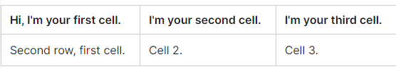
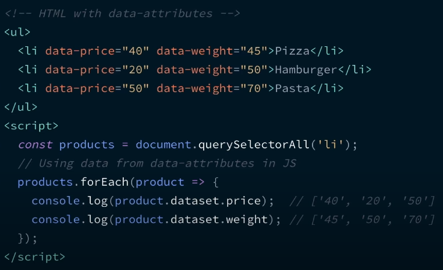
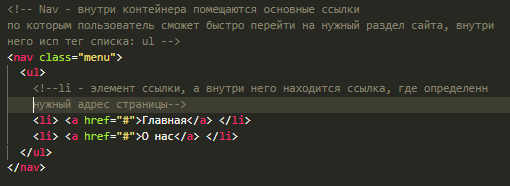
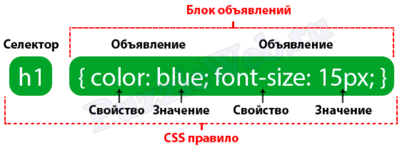
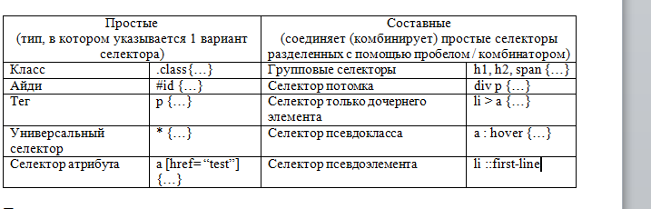
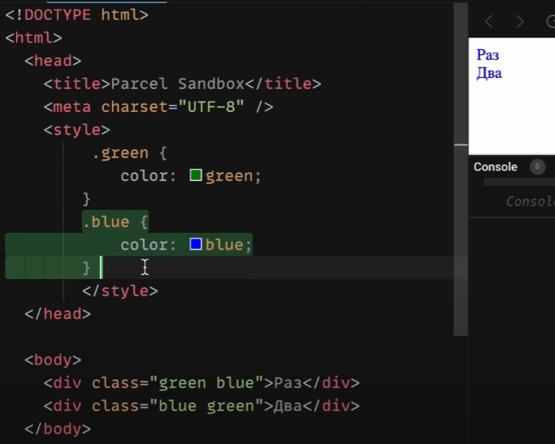
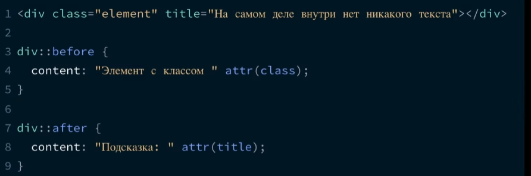

### HTML (HyperText Markup Language)

<details>
<summary> Что такое HTML и опишите базовую структуру HTML-страницы? </summary>

HTML (Hypertext Markup language) – язык гипертекстовой разметки. Он используется для отображение веб-страницы в браузере. Базовая структура HTML состоит из 

1. `<!Doctype html>`, которая указывается в самом начале и сообщает браузуру, что мы используем последнюю версию HTML5

2. `<head>` - содержит информацию о документе, в нем может хранится заголовок, шрифты, стили и метатеги. Метатеги - дополнительная информация о веб-странице, которая затем передает информацию поисковой системе. Например:  

* кодировка: UTF-8; 
* имя автора страницы
* описание страницы;
* ключевые слова для продвижения. 
* метатег вьюпорт (`meta name="viewport"`) сообщает браузеру, как именно обрабатывать размеры страницы и изменять её масштаб.

```
`<meta name="viewport" content="width=device-width, initial-scale=1">`

1. meta name="viewport" -  сообщает браузеру о том, как именно обрабатывать размеры страницы,
и изменять её масштаб. 

2. content="width=device-width - ширина области просмотра, которая задает ширину в
соответствии с девайсом

initial-scale=1 - начальный масштаб страницы: 1.0 (обычно определяет). 
Свойство max-scale/min-scale – определяет как пользователям разрешено
увеличивать или уменьшать страницу. А если мы хотим запретить 
масштабирование используем userscalable: 0

```

3. `<body>` – содержит всю разметку html документа. Именно это разметка и будет отображается в браузере.

</details>


<details>
<summary>Есть ли у HTML – элементов свои дефолтные специфичные стили?</summary>

Да, конечно есть, практически во всех: 
- У загаловках - это размер шрифта, отступ и жирность;
- У списков – маркеры и цифры; 

Однако стоит упомянуть, что в разных браузерах они могут отмечаться по разному, у кого-то размер шрифта побольше например, обычно прибегают к обнулению стилей (reset.css) или делает для всех стилей одинаковые стили (normalise.css)
</details>


<details>
<summary> Что такое инлайновый стиль? Можно ли его переопределить?</summary>

Инлайновый стиль – это стиль, который находится внутри определенного тега. У него вес 1000 и это самый большой вес селектора, которого крайне трудно перероделить. Переопределить его можно только с помощью !important, 
</details>
 

<details>
<summary> Что такое семантика? Какие семантические тэги вы знаете?</summary>

Раньше все программисты писали с помощью дивах и спанах, однако с появлением семантических тегов в HTML5, то много что поменялось. и они помогают браузеру и поисковым системам, анализировать и понимать структура, содержимое нашего веб-приложения. А также он повышает доступность (accessibility). Например для слабовидящих - скринридер читает текст делая на каких-то словах акцент по типу strong или em. Вместо картинки, скринридер читает поясняющий текст внутри img тега alt.

Дополнительные вопрос: 

<details>
<summary> - Какая разница между тэгами `strong` и `em` и `b` и `i`?</summary>

Теги: `strong` и `b` (bold) - делает текст жирным, 
Теги `em` (emphasis) и `i` (italic) - делает его курсивным. 

Основное отличие одни из них семантические (strong, em), а другие не семантические (b, i) - когда скринридер читает теги strong и em он делает на них небольшой акцент, в то время как на b и i он не делает акцента

</details>


<details>
<summary> - Типы списков в HTML?</summary>

1. `<ul>` - маркированный список. Каждый элемент списка отмечается маркером: li;
2. `<ol>` - нумерованный список. Каждый элемент списка отмечается маркером: li;
3. Cписок определений, cостоит он из следующиз тегов: `dl` – основная обертка, `dt` –определения и `dd` – поясняющий текст;

</details>

<details>
<summary> - Для чего используются тэги tr, th, td?</summary>

Данные теги используются внутри другого тега: `<table>`, а тот в свою очередь необходим для создания таблиц:

`<tr>` (table row) – контейнер для создания строки таблицы
`<th>` (table-header) – предназначен для создания одной ячейки таблицы в виде заголовка
`<td>` (table-data) – ячейка таблицы 

```
<tr>
  <td>Hi, I'm your first cell.</td>
  <td>I'm your second cell.</td>
  <td>I'm your third cell.</td>
</tr>
```



</details>


<details>
<summary> - Для какого тэга используется атрибут alt и зачем он нужен?</summary>

Он пишется в img. Если вдруг у нас картинка не отобразится на странице, то вместо него отобразится (поясняющий) текст, тот который мы указали в alt. 

Данный атрибут также полезен для людей с ограниченными возможностями, когда страница будет читаться скринридером, то при чтении и будет зачитываться то, что находится в alt. (Помимо этого использование атрибута улучшается accessibility (доступной страницы) так как различные скринридеры при чтении веб-страницы зачитывают его. В результате пользователи с ограниченными возможностями понимает контекст используемого изображения)

Она еще необходимо для валидации

</details>

---

</details>


<details>
<summary> + Что такое валидация? И какие типы проверок HTML документа вы знаете?</summary>

Валидация HTML-разметки — это проверка кода веб-страницы на соответствие стандартам Консорциума Всемирной паутины (World Wide Web Consortium, W3C).

Работа валидатором заключается в следующем: сначала определяется тип документа, который указывается с помощью <!Doctype> затем проверяет html код на правильность и отсутствие ошибок. W3S 

</details>


<details>
<summary> 4. Почему хорошей практикой считается располагать link для подключения CSS стилей внутри тэга head, а script для подключения JS ставить перед закрывающим тегом body</summary>

1. Тег link внутри шапки сайта описана сцепификацой HTML. Если в head находится stylesheet, то страница загружается быстрее 

2. Сначала подключаются html и css при первой загрузке страницы и они должны находится в самом header. После того как все загрузилось используется js, если мы поставим js в самое начало, то оно будет блокировать (загрузку) от рисовку html. Размещение скриптов внизу позволяет сперва распарсить и показать пользователю весь HTML, а затем уже добавить к нему логику.

</details>


<details>
<summary>9. Для чего используется элемент datalist? </summary>

Используется для создания выпадающего списка, которое можно выбирать при наборе в текстовом поле и datalist с атрибутом id должен полностью совпадать с содержимым: "" с input элементом атрибутом лист. 
</details>


<details>
<summary> 13. Типы `input` элементов в HTML? (Необходимо перечислить их и назвать особенности)</summary>

Input – элемент необходим для общения (коммуникации) с пользователям, он предназначен для получение вводимых данных. У него есть атрибут type, который поможет выбрать тот или иной тип: 

* input type = “text” - предназначенный для ввода букв, цифр и специальных символов. 
* input type = “password” – используется для паролей. Его особенность - отображаются как звездочки. 
* input type = “email”> - предназначен для ввода эмейла пользователи.  
* input type = “number”> - позволяет вводить только числовое значение ну и при фокусировке на нем открывается клавиатура, содержащие только цифры. 
* input type = “button” (input type = “submit”) – поле для ввода. В этом случае превращается в кнопку, с помощью сабмит можно даже отправить форму. 
* input type checkbox ( radio)  button - заменяет поле ввода на специальные элементы либо квадрат с галочкой либо кружок с точкой. 
* input type day month daytime local предназначены для ввода даты. 

</details>


<details>
<summary>15. Представьте HTML5 как открытую веб-платформу. Из каких блоков состоит HTML5?</summary>

•	Семантика (позволяет более точно описать из чего состоит контент).
  
•	Стилизация (позволяет создавать более сложные темы оформления).
  
•	Доступ к устройствам (позволяет взаимодействовать с различными устройствами ввода и вывода).
  
•	Связанность (позволяет общаться с сервером).
  
•	Офлайн и хранилище (позволяют страницам хранить данные локально на клиентской стороне и более эффективно работать в офлайне)
  
•	Мультимедиа (создание и подключение видео и аудио).
  
•	2D/3D-графика и эффекты (позволяет расширить возможности презентации).
  
•	Производительность и интеграция (обеспечивает большую скорость оптимизации и лучшее использование аппаратных средств).

</details>

<details>
<summary>15. Для чего используют data-атрибуты?</summary>

До появления JS-фреймворков, он использовался (применялся) для  хранений информаций. А в последующем можно было использовать в JS для манипуляции. 

Другими словами: прямо в дом дерева можно хранить дополнительные данные, основным минусом была безопасность, она была слабая, так как изменить атрибут без проблем можно через консоль разработчика



</details>


<details>
<summary>16. Разница между `script`, `script async` и `script defer`? (Асинхронный и отложенный)</summary>

Обычно браузеры загружают `script` синхронно, во время разбора документа. Поэтому принято добавлять скрипты в конец документа, перед `</body>`, чтобы они не тормозили загрузку страницы. Но при помощи атрибутов defer и async можно явно управлять порядком загрузки и выполнения скриптов.

* `<script async src="...">` => скрипт выполняется параллельно c чтением html документа. Он не будет ждать когда произойдет загрузка и отображение веб-страницы. Он  хорош для независимых скриптов, например счётчиков и рекламы, порядок выполнения которых не играет роли.

* `<script defer src="...">` – указывает браузеру, что скрипт должен быть выполнен после того, как как произойдет полная загрузка html. 

На практике defer используется для скриптов, которым требуется доступ ко всему DOM-дереву или если важен их порядок выполнения.

</details>

---


#### Практика


<details>
<summary> 1. Как семантически верно сверстать навигационное меню?</summary>

</details>

<details>
<summary> 2. Как можно скрыть элемент разметки не используя CSS и JS?</summary>

В html есть для этого специальный атрибут: hidden, однако это не самая лучшая практика влиять на страницу через разметку, так как он не виден не только для пользователя, но и для скринридеров. Данный тег глобальный и его можно добавлять везде. Его аналог в css – это display: none
</details>

<details>
<summary> 3. Какой тег использовать для того, чтобы сверстать кнопку?</summary>

Обычная кнопка: `<button>Кнопела</button>`	

Кнопка подверждения формы, используется:
```
<button type=”submit”>КнопелаИная</button>
<input type=”submit” value=”button>	

<input type = “button”>
```
</details>


---


### CSS (Cascading Style Sheets) - каскадная таблица стилей

<details>
<summary>1.	Что такое CSS? И для чего он используется?</summary>

CSS (Cascading Style Sheets - “каскадные таблицы стилей”) - формальный язык, с помощью которого описывают внешний вид документа HTML, XML, XHTML. CSS используется для оформления внешнего вида документа (например: для задания цветов, шрифтов, стилей, расположения блоков и т.д). 

Мы выносим стили в отдельный css-файл, чтобы отделить логику и структуру веб-страницы (написанную на HTML) от описания её внешнего вида. Такое разделение дает больше гибкости и возможностей, а также позволяет уменьшить сложность и повторяемость в структурном содержимом.

Другой источник: CSS – каскадная таблица стилей, предназначенная для добавления различных стилей на html страницу. Если чистый html представляет собой каркас (скелет) страницы, то задача CSS - добавить различные визуальные эффекты.
Дополнительная литература: https://blog.ingate.ru/seo-wikipedia/css/

</details>


<details>
<summary>2.	Что такое CSS-правило?</summary>

СSS-правило относится к синтаксису CSS. Синтаксис состоит из селектора и блока объявлений, в котором описываются свойства со значениями:



CSS-правило сообщает браузеру, что и каким образом будет отформатировано тот или иной селектор. Например: изменить цвет текста заголовка, выделить изображение красной рамкой, установить ширину блока в 200 пикселей и т.д. 
</details>


<details>
<summary>3.	Варианты добавление CSS стилей на страницу?</summary>

* Inline style (внутренние) - в теге добавляется слово style и так мы добавляем стиль
* Внешние стили - когда в html, в хедере пишем стиль
* Отдельный файл со стилями, который подключается через элемент link, в элементе head, `<link rel="stylesheet" type="text/css" href="style.css">`
</details>


<details>
<summary>4.	Что такое селектор? И какие селекторы существуют?</summary>

Селектор необходим для того, чтобы сообщить браузеру к какому элементу (элементам) будет применен стиль. Они делятся на простые и составные

 

1. Универсальный селектор – применяется стиль для всех элементов веб страницы.
2. Селектор атрибута – отбирает элементы по наличию атрибута или его значению. Другими словами, ищет из этого: a [href= “test”] {…} вот это <a href = “test”> … </a>
3. Селектор потомка – цепочка перечисленных через пробел селекторов, обозначает вложенность от родительских элементов к потомку, что позволяет управлять стилями вложенных элементов
4. Селектор только дочернего элемента (комбинатор >) – непосредственно располагается внутри родительского элемента. Ссылка: https://webref.ru/css/selector/child, а также стоит отметить, что он позволяет выбрать элементы только первого уровня вложенности: https://metanit.com/web/html5/5.4.php


</details>


<details>
<summary>5. Разница между классом и идентификатором (id) в CSS? Когда что использовать</summary>

* id - должен быть уникальным и встречаться на странице 1 раз. Вес id - 100; и айди у элмента должен быть только один. Для добавлении логики
* class - можно задавать и использовать много раза. Вес класса - 10; у одного элемента может быть несколько классов. Для добавление стилей

</details>

<details>
<summary>6. Что такое перечисление (комбинатор, группировка) селекторов?</summary>

При помощи перечисление нескольких селекторов через запятую можно избежать дублирования кода. 

Если в нескольких элементов есть определенные повторяющиеся стили, то вполне допустимо вынести эти стили в отдельный блок, после чего в качестве селектора указать несколько классов, тегов, идентификаторов перечислив их через запятую (,). 

Таким образом, описанные стили будут применены сразу к нескольким элементам и нет необходимости повторно писать один и тот же код для каждого селектора

</details>


<details>
<summary>7. Что такое специфичность селекторов. Как перечислить вес селектора</summary>

СС – способ с помощью, которого браузер определяет какие значения CSS – свойства будут применены к элементу. Он представляет собой вес, придаваемый конкретному элементу CSS. 

Инлайновый селектор: 1000
ID (айди): 100
Класс, псевдокласс, атрибут: 10
Элемент, псевдоэлемент:	1

```
li	                                  => 1
ul li	                  1 + 1         => 2
#main .item	            100 + 10      => 110
h1 + *[href= “test”]	  10 + 1        => 11
#test p	                100 + 1       => 101
li. item.main	          1 + 10 + 10   => 21
#test	                                => 100
ul ol li .item	      1 + 1 + 1 + 10  => 13
ul ol+li	            1 + 1 + 1       => 3
a:hover	              1 + 10          => 11
```

Такие просчеты нужны для того, чтобы писать максимально чистый css-код без постоянного использования important (используется для того, чтобы придать наивысший приоритет среди других)

Стоит отметить, что если специфичность одинаковая то срабатывает последний стиль



Какой вес у звездочки?

</details>

<details>
<summary>8.	Что такое псевдоэлементы и псевдоклассы?</summary>

Псевдоэлемент – это ключевое слово, которое добавляется на селектор и позволяет стилизировать определенную часть выбранного элемента. 

`::first-letter` – используется для изменения первой буквы в тексте

`::first-line` - используется для изменения первой строчки блочного текста

`::after` – применяется для вставки желаемого контента ПОСЛЕ выбранного элемента. Например: http://htmlbook.ru/css3/after

`::before` – для вставки контента ДО выбранного элемента. Например:
http://htmlbook.ru/css3/before

`::selection` – позволяет применить стили к части документа, которая была выделена у пользователя. Например: http://htmlbook.ru/css/selection


Псевдокласс - это какое-то состояние нашего элемента. Например у нас есть абстрактная ссылка с помощью: `псевдокласса (:hover)` - мы можем изменить при наведении на ссылку - цвет либо через псевдокласса `:active` (сделать текст) красным. Через :visited после того как зашли изменить цвет не на фиолетевый а на ярко-голубой

Или у нас есть маркированный список и мы хотим изменить первую и последню лишку, для этого нам нужны псевдоклассы: `:first-child и :last-child`.

Расскажите про псевдокласс: has. 
</details>


<details>
<summary>10. Блочная модель CSS?</summary>

Определяет размеров блока на странице и их взаимодействие между собой. Состоит он из следующих свойств:

- содержимое (это может быть текст, изображение, видео и др.), ширина (содержимого), которого задается свойством width, а высота (cодержимого) через height;
- padding — внутренний отступ;
- border - границы 
- margin - внешние отступы

</details>

<details>
<summary>11. Что делает box-sizing: border-box</summary>

Если это свойство не задать, то к размеру блока будут добавляться внутренние отступы и рамка. Но если задать то ширина и высота будет включать значение полей и границ, но не отступов margin
</details>


<details>
<summary>11. Что такое схлопывания границ? </summary>

Cхлопывание границ (margin collapsing) - такое поведение, когда margin-top и margin-bottom
объединяются в один отступ. Например у нас есть 2 margina: 10 и 50 пикселей. И будет не 60 пикселей отступа, а 50


</details>

<details>
  <summary> 11.5. Разница между относительными и абсолютными величинами (em / rem, px) и т.д.</summary>

К относительным единицам относятся em - когда размер шрифта у нас классический 16, то на em 2 = будет 32, rem (относительно размера шрифта элемента), % ( измерение в процентах.), vw – 1% от ширины области просмотра (50% это половина ширины области просмотра). vh – 1% от высоты области просмотра (50% это половина высоты области просмотра)., а к абсолютным пиксели
</details>
  


<details>
<summary>12. Типы позиционирования в CSS?</summary>

* Static position (нормальное / статическое позицинирование) - значение по умолчанию, свойства top, right, bottom, left игнорирует;

* Relative position (относительное позиционирование) - элемент сдвигается относительно его обычного положения. Его можно менять с помощью top, right, bottom, left. 

* Absolute position (абсолютное позиционирование) - исчезает из того места в котором был и позиционируется заного. Остальные элементы распологаются так, как буд-то этого элемента и не было. Координаты: top, right, bottom, left отчитываются от ближайшего позиционированного родителя или от всего документа. Он работает с z-index. 

* Fixed position (фиксированное позиционирование) - когда нам необходимо зафиксировать какой-то контейнер в одном месте и при скроле он будет идти вместе с нами.

* Stiky position (липкое позиционирование) - похож на фиксированное позиционирование. Отличие от него, то что он крепится в рамках какого-то блока, а не всего документа. Нельзя позиционировать элемент по горизонтале, а может только по вертикале через свойства (top, bottom) - относительно вверха низа страницы 

Допольнительный вопрос: что такое z-index, и как он работает
</details>


<details>
<summary>13. Свойство display - какие значение принимают и как они работают?</summary>

1. None - это когда элемент не показывается на экране вообще
2. Block - это блочные элементы, которые распологаются вертикально один за другим. Он стремится расширится на всю доступную ширину
3. Inline - они распологаются на одной строке, последовательно одним за одним. Ширина и высота по содержимому и менять высоту и ширину нельзя
4. Inline-block - элемент является строчным, но при этом ему можно задавать ширину и высоту
5. Flex 
6. Grid
7. Table-row
8. inherit;
9. initial;
10. unset;
11. list-item;


</details>


<details>
<summary>14. Как с помощью CSS определить, поддерживается ли свойство в браузере?</summary>

Для этого есть специальная директива @supports(){}. Она проверяет, поддерживается ли свойство, правило, или css-селектор в браузере. В круглых скобках пишется условие проверки, а в фигурных скобках код, который выполнится, если условие поддерживается. Пример:
</details>


<details>
<summary>15. Какие фильтры есть в CSS?</summary>

1. `Blur (px,em)`	- размытие по Гауссу к исходному изображению. Чем больше радиус, тем больше размытие. Начальное значение: 0
2. `Brigtness (%, 10-дробь)` - изменяет яркость изображение. Также чем больше, тем ярче. Начальное значение: 1
3. `Сontrast (%, 10-дробь)` -	регулирует констрастность между самым темным и светлым участком фона. Начальное значение: 100%, ниже будут уменьшать контрастность, а выше будут увеличивать
4. `Drop-shadow`		Смещение по оси Х смещение по оси Y размытость растяжение цвет тени
5. `Grayscale (%, 10-дробь)` - извлекает все цвета из картинки, делая на выходе черно-белое изображение.


</details>

<details>
<summary>16. Что такое CSS-атрибут (attr)?</summary>

Это css-функция, которая позволяет в файле css достучаться до любого значения атрибута элемента. Работает и с псевдоэлементами. 


</details>


<details>
<summary>17. Для чего используется ключевое слово currentColor в CSS?</summary>

Ключевое слово: currentColor можно использовать в качестве значения для CSS- свойства принимающего цвет (то есть она будет работать для свойств: color, background-color, box-shadow, text-shadow). 

Например, есть: color: blue, и внутри него есть box-shadow: … currentColor, и css автоматически подставит тот самый синий цвет (текущее значение свойства – color). И в случаи изменение одного цвета – изменятся и остальные, которые находятся в currentColor, то есть поменяются на другие цвета

</details>


<details>
<summary>18. Что такое CSS-спрайт? И для чего он используется?</summary>

CSS–спрайт – это картинка, которая объединяет несколько изображений в одно большое. Данный подход используется для набора иконок. 


В первую очередь сокращает кол-во обращений к серверу, так как вместо несколько запросов достаточно сделать только один. 

Дополнительно – это выполнения предзагрузки пока невидимого контента. То есть иконка, которая отображается по наведению, будет загружена заранее, в результате не будет видно мигание при смене картинок

</details>


<details>
<summary>19. Разница между reset.css / normalize.css</summary>

Практически все html-элементы содержат дефолтные стили: размер и жирность шрифта, внутренние и внешние отступы и др. Основной нюанс заключается в том, что каждый браузер применяет разные стили. И для того, чтобы вверстка выглядела одинокого, используют обнуления стилей: reset.css / normalize.css

Они подключаются в самом начале css-файла. И reset.css сбрасывает все дефолтные стили на ноль, а normalize – нормализирует (стабилизирует) для различных браузеров – сохраняет дефолтные стили и делает их везде одинаковым. Недостатком reset.css – это то, что мы стили пишем заново. История: https://www.youtube.com/watch?v=KGYmOlNteas

</details>


<details>
<summary>20.	Что такое вендорные префиксы (vendor prefix)? И для чего они используются?</summary>

Вендорные префиксы – это приставка к названию CSS – свойства, которые добавляют производители браузеров для не стандартизированных (специфических) свойств.

```
-o-	Opera
-moz-	Mozilla
-ms-	Microsoft
-webkit-	Apple
```

Работают они следующим образом: для элемента прописывается CSS свойство в прямом виде для браузеров, которые его понимают. Следом за ним через точку с запятой перечисляется то же самое свойство, но с разными вендорными префиксами для разных браузеров. Браузер из такого кода интерпретирует только то свойства, которое написано под него, а написанные для других браузеров игнорирует.
Может быть вопрос: где можно посмотреть, как поддерживается то или иной свойство? -  Ответ: https://caniuse.com/flexbox

</details>


<details>
<summary>21. Порядок наложения элементов в CSS (Stacking Order)?</summary>

Элементы в HTML имеют объёмную структуру, поэтому они способны перекрывать друг друга. Это поведение можно регулировать с помощью свойства z-index! Но при его отсутствии существует свой порядок наложения (Stacking Order). 

Перечисление по порядку (с самого нижнего): 
* background и border элемента – позиционированные элементы и их дети; 
* элементы с z-index меньше нуля; 
* элементы блочного уровня (в нормальном потоке = position: static); 
* плавающие элементы (float элементы); 
* inline-элементы;
* элементы с z-index=0 или after;
* элементы со свойством opacity меньше 1;

</details>


<details>
<summary>22. Как поддерживать страницы в браузерах с ограниченными функциями?</summary>

Существуют разные техники поддержания кода в «старых» браузерах:
1. Библиотека Modernizer - это библиотека JavaScript, которая определяет функции, доступные в браузере пользователя. Это позволяет веб-страницам избегать неподдерживаемых функций, информируя пользователя о том, что его браузер не поддерживается, или загружая полифилл. 
2. Директива supports – см описание в вопросе выше.
3. Autoprefixer- это веб сервис для расстановки вендорных префиксов для лучшей кроссбраузерности. Автопрефиксер использует данные о популярности браузеров и поддержке ими вендорных префиксов. Опираясь на эту информацию, он расставляет и удаляет префиксы. Автопрефиксер поможет вам с префиксами для: animations, transition, transform, grid, flex, flexbox и других.
4. Ресурс: Caniuse.com – для проверки поддрежки браузеров.

</details>


<details>
<summary>23. Как исправлять специфичные проблемы со стилями для разных браузеров?</summary>

Поскольку существуют разные браузеры, для некоторых свойств в них закладываются разные значение, в результате одна и та же страница может выглядеть по-разному. Применяются разные подходы, чтобы унифицировать начальные стили: 

1. Использование Autoprefixer для автоматической вставки браузерных префиксов. Она берёт с Can I Use последние данные о префиксах и популярности браузеров, читает ваш файл стилей, находит свойства и значения, которым действительно нужны префиксы и добавляет их. Есть и свои недостатки: https://habr.com/ru/company/evilmartians/blog/176909/, но я опустил этот момент

2. Подключение reset.css / normalize.css
3. Разделение стилей для разных браузеров, и их динамическая подгрузка
4. Использование сторонних проблем: по типу bootstrap, tailwind (которая уже решает эти проблемы со стилями).
5. Тестирование приложение в такой платформе как: browserstack

</details>


<details>
<summary>24. Глобальные ключевые слова в CSS?</summary>

Для всех свойств CSS можно задать значения в виде ключевых слов: initial (значение по умолчанию), inherit (наследование), unset, revert.

* initial – значение по умолчанию. У каждого блока есть свои базовые (не браузерные) значения по умолчанию, который срабатывают еще до написания css -стилей.

* Inherit – заставляет в элементе использовать вычисленное значение свойства из родительского элемента. Т.е. берется значение свойства, как у родителя.

* Unset - устанавливает значение свойства как inherit, если свойство наследуется от своего родителя, в противном случае (т.е. если свойство не наследуемое), значение устанавливается как initial.

* Revert – возврат к браузерным стилям. (не путать с initial). 

</details>

---

#### Практика:

<details>
<summary>1. Как сделать с помощью html и css: круг, прямоугольник, квадрат, треугольник, стрелу
</summary>

`Круг` - border-radius: 50%

`Прямоугольник` - ширина должна быть больше высоты

`Квадрат` - ширина и высота должны быть одинакового размера

`Треугольник` 

```
border-left: 50px solid transparent;
border-right: 50px solid transparent;
border-bottom: 100px solid red;
```

`Стрела`

Стрела направо - transform: rotate(-45deg);
Стрела налево - transform: rotate(135deg);
Стрела вверх - transform: rotate(-135deg);
Стрела вниз -  transform: rotate(45deg);


</details>


<details>
<summary>2. Перечислите способы центрирования блока</summary>


1. Через флексбокс: 
```
display: flex;
justify-content: center
align-items: center

```
2. Через margin: 0 50; а также margin: auto
3. Через абсолютное позиционирование
4. Через vertical-align: middle
</details>

<details>
<summary>3. Как изменить направления оси flex-контейнера?</summary>

display: flex;
flex-direction: column
</details>

<details>
<summary>4. Как сделать анимацию безконечно повторяющейся?</summary>

Animation-duration: infinite
</details>


<details>
<summary>5. У нас есть список ul и li, как сделать горизонатальная меню </summary>

```
ul {
  list-style: none; /*убираем маркеры списка*/
  margin: 0; /*убираем отступы*/
  padding-left: 0; /*убираем отступы*/ 
}
a {
  text-decoration: none; /*убираем подчеркивание текста ссылок*/
}
li {
 float:left; /*Размещаем список горизонтально для реализации меню*/
  margin-right:5px; /*Добавляем отступ у пунктов меню*/
}
```
</details>

<details>
<summary> 6. У нас есть список из пяти скажем так блоков, как сделать так чтобы 5 блок был не виден </summary>


Через псевдокласс nth-child или last-child
</details>


<details>
<summary>7. Почему у картинки необходимо выставлять ширину и высоту у картинки</summary>


</details>


<details>
<summary>8. Расскажите про поток документов</summary>

</details>

---


### SASS (SCSS)

<details>
<summary> 1. Что такое препроцессоры? Какие бывают препроцессоры CSS? </summary>

Препроцессоры - упрощают работу с CSS-кодом путем добавление таких опций как: миксины (примеси), вложенные правила (вложенность), селекторы наследования и т.д.

Sass, scss, less

</details>

<details>
<summary>2. Что такое миксины (примеси)?</summary>

Миксины позволяют определять стили, которые можно повторно использовать в разных местах

Чтобы создать миксин, необходимо указать ключевое слово @mixin и дать ему уникальное имя.  Для включения миксина в селектор используется ключевое слово @include после чего указывается имя миксина, который мы хотим подключить

</details>

<details>
<summary>3. Что такое каскадность? </summary>

Каскадность – это механизм CSS, который определяет какие стили в итоге будут применены к элементу.
</details>


### Методология 

<details>
<summary>1. БЭМ</summary>

БЭМ - методология, которая расшифровывается как блок, элемент, модификатор. Разработан он яндексам как компонентный подход к веб-разработке. 

Он создан в первую очередь для переиспользование компонентов, что помогает в работе на крупных проектов. 

Блоки - это независимые единицы, которые могут состоять из других блоков или элементов. Элемент является его дочерним элементом. А модификатор - класс, который позволяет стилизовать элемент, который отличается от других элементов этого порядка


Например у нас есть меню на сайте - блок; ссылки в меню - это элемент; а разный цвет ссылок в зависимости от темы - модификатор

</details>
