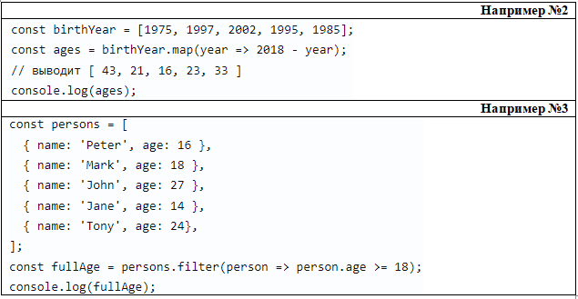
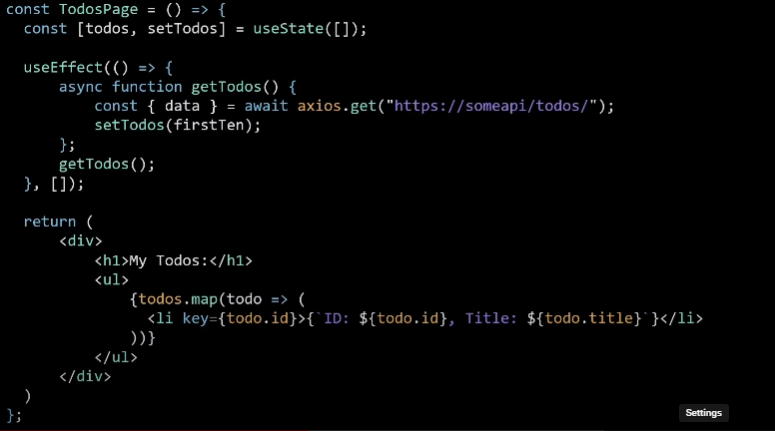
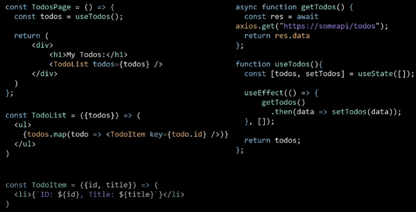

#### I. Основы

<details>
<summary> Перечислите типы данных в JavaScript? </summary>
В JavaScript существует 8 типов данных, их можно разделить на примитивные и ссылочные. К примитивным относятся следующие типы:

- `string` (строка),

- `number` (число),

- `biginit`,

- `boolean`,

- `symbol` (уникальный идентификатор) - необходимо для создания уникальных id, чтобы создать его необходимо написать функцию Symbol(""). Если сравнить два одниковых символа между собой, они никогда не равны

- `null`,

- `undefined`

Стоит отметить, что разница между null и undefined в том, что `Undefined` - это когда переменная объявлена, но мы ей не присвоенно значение, а `null` - когда мы присвоили значение специально, и как бы говорим, что у нас есть переменная и она пустая. Кстати при нестроговом сравнение undefined и null дает true, а при строгом false, а также при сравнение null == 0 дает false

А к ссылочному относится:

- `object`, в котором можно хранить данные с помощью ключа и значение. И один объект не похож так как сравниваются ссылки на объект, а не значение как примитив

А определить тип данных можно с помощью typeOf.

<details>
<summary>Question: Как превратить любой тип данных в булевое и разница между явным и невным преобразованием? JavaScript статически, или динамически типизированный язык?</summary>

В JS мы можем явно преобразовать типы, всего их три: String(), Boolean(), Number() - и все они являются функциями.

Чтобы превартить тип данных в булевый можно использовать:

1. Функцию Boolean(null)
2. !! (Двойное логическое не), `Допилить идею: Если мы применим его к не пустой строке, то оно сначало станет false, а затем true`

Чтобы превратить тип данных в числовое можно использовать:

1. Функцию Number('5')
2. метод parseInt("5")

Что превратить тип данных в строку можно использовать:

1. Функцию String(null)
2. Или через метод Object.prototype.toString(43)

Разница заключается в том, что неявное преобразование происходит автоматически путем арифмитические действий, а явное когда мы указываем тип специально через функции Number или ParseInt, функцию String или метод toString, Boolean или двойное логическое !!

Динамически типизированный язык, так как происходит автоматическое преобразование типов

</details>

<details>
<summary>Question: Перечислите все ложные (falsy) значение? Что такое NaN?</summary>

Falsy - это следующие значение: "", 0, null, undefined, NaN, false. А все остальное уже true

NaN расшифровывается как not-a-number, что означает не является числом. Мы получаем его когда выполняем математическую операцию неправильно. Например, если мы infinity разделим на intinity, то оно нам даст NaN. Для того, чтобы проверить, что число не является числом использует функцию isNaN()
А его особенностью можно выделить то, что она не равна ничему даже самому себе как в строгом, так и в нестрогом сравнении.

</details>
</details>

<details>
<summary> Какие операторы вы знаете? </summary>

I. Арифмитические операторы:

- сложения,
- вычитания,
- умножения,
- делание,
- возведение в стене `**`
- взятия от остатка `%`

II. Логические операторы:

- Или (||) - ищет первое truthy значение и возвращает его. У него самая большая приоритетность и он будет выполняться первый
- И (&&) - ищет первое falsy значение и возвращает последнее значение, если оба значеные верны.
- ! (Логическое не) - меняет значение на противоположное. Например если строку мы обернет в логическое !'str', то у нас false

К особенностям стоит отметить, что есть также приоритетность, но если мы обернем в скобки то данная приоритетность уже не будет иметь разницы.

III. Операторы сравнения:

- больше, меньше, меньше или равно, больше или равно,
- нестрогое (==) и строгое равенство (===). => Строгое равенство отличается от нестрогого тем, что нестрогое сравнивает только значения без приведения типов, а строгая сравнивает и значения и типы
- не равно (!=).

#### Question: Что такое оператор нулевого слияние ??

Он возвращает значение правого операнда, если левый операнд содержит null или undefined, в противном случае возвращается значение левого операнда. Он похож на или, так как он возвращает правый операнд если в левом хранится ложное значение, а не только null / undefined

</details>
</details>

<details>
<summary> Циклы, инструкция: switch...case</summary>

- for (let i=..; i > str; i++) - классический цикл, когда нам необходимо какое-то действие повторить несколько раз

- for ... in - служит для перебора объекта и возвращает нам ключи. Если нам необходимо получить значения, внутри цикла нам необходимо в квадратных скобках написать значения.

```
const uniqueUser = {
  name: "Valera",
  age: 24,
  isAdmin: true,
}

for (const key in iterable) {
  console.log(key) // name, age, isAdmin
  console.log(uniqueUser[key]) // Valera, 24, true
}
```

Если мы решим использовать их в массиве, то получим индексы.

```
const myLifeSummedUp = ["☕", "💻", "🍷", "🍫"]

for (let item in myLifeSummedUp) {
  // 0 1 2 3
  console.log(item)
}
```

- for ... of - служит для перебора массива и возвращает нам значения.

#### Отличие while и do while

do ... while - должен выполнится хотя бы один раз и не важно верны ли условия или нет, в то время как while может и не выполнится если условия не подходят

#### Что такое switch/case и где он используется?

Внутри есть кейсы (те в свою очередь делают строгое сравнения между значения), и после каждого кейса необходимо писать break, если не указать, то проверка пройдет дальше, есть также continue, который пропускает.

Если говорить про реакт, то используется он в редьюсерах (редаксе). И например когда нам нужно именно точное сравнения

</details>

<details>
<summary> Методы в JavaSciprt</summary>

<details>
<summary> Числа (number), строки (string) и математические (math) </summary>

##### 1. Number method

- `.toString()` - число преобразоывавает в строку
- `.parseInt()` - берет строку и возвращает целое число
- `.isNaN()` - проверяет, является ли значения числа наном
- `.isFinity()`- проверяет, является ли число конечным

##### 2. Math method

- `.min(1, 2, 3)` - вернуть минимальное число
- `.max(2, 3, 4)` - вернуть максимальное число
- `.random(1, 2, 3)` - можно получить рандомное число
- `.floor()` - округляет в меньшую степень
- `.ceil()` - округляет в большую степень
- `.pow(2, 3)` - принимает два значения и возвращает возведенную степень `(3, 3) // 27`
- `.abs()` - возвращает абсолютное значение числа. Если это пустые кавычки или пустой массив, то это 0

Ну и другие по типу косинуса, синуса метода

##### 3. String methods

- `.toUpperCase()` - берет строку и пишет ее с большой буквы (преобразованное в верхний регистр).
- `.toLowerCase()` - берет строку и пишет ее с маленькой буквы (преобразованное в нижний регистр).
- `.split()` - делает из строки массив
- `.trim()` - удаляет пробельные символы с начало и конца строки
- `.startsWith()` проверяют начинается-ли строка с определенного символа который мы укажем внутри
- `.endsWith()` делает противоположное, тобишь заканчивается строка c определенным символом

</details>

<details>
<summary> Массив (array)</summary>

- `.isArray()` => проверяет является ли значение массивом
- `.find()` - вернёт первый найденный в массиве элемент, который подходит под условие.
- `.findIndex()` - возвращает уже не найденный элемент, а индекс
- `.concat()` - когда есть два разных массива и нам нужна их объединить
- `.flat()` - когда внутри массива есть еще один массивы и мы хотим их все объединить в один общий через infinity либо указать определенную вложенность объединить, где 1 - на 1 уровень вложенности
- `.splice()` - который меняет исходный массив, c помощью данного метода мы можем удалять или добавлять внутрь массивы какие-то элементы
- `.slice()` - копирует старый массив и возвращает на его основе новый. Он просто копирует его.

Следующие 4 метода меняют исходных массив

- `.push()` - добавляет элементы в конец массива и возвращает новую длину массива.
- `.pop()` - удаляет из массива последний элемент и возвращает его значение.
- `.unshift()` - добавляет элементы в начало массива и возвращают новую длину массива.
- `.shift()` - удаляет из массива первый элемент и возвращает его значение.

Что будет работать быстрее? => Pop и push - так как их задача лишь добавить или удалить элемент в конце массива, а shift и unshift медленее так как помимо удаление или добавления первого элемент они будут сдвигать массив вправо или влево.

- `.forEach()` и `.map()` => с помощью .map, мы можем использовать и другие методы.

</details>

#### Какие методы мутируют и не мутирует исходный массив?

Мутирующие sort, reverse, push, pop, shift, unshift, splice, а к немутирующим можно отнести: map, filter, slice, concat,

</details>

<details>
<summary> Объект</summary>

Объект - это тип данных, где хранятся ключи и значения и выделяют следующие типы объектов - функции, массив, даты и коллекция: maps и weakmaps, sets и weaksets. В JS существует несколько способов создания объекта - это через фигурные скоба `{}`; через ключевое слово: `let user = new Person("Win")`; через object.create(): `let user = Object.create(person)`

Стоит отметить, что ключевое слово new делает несколько вещей:

- Создает новый пустой объект, который наследуется от prototype;
- К нему (объекту) привязывается значение this;
- Возвращает значение this, если в реализации не указано иноеэ

Разница между объектом и массивом

- У массивов есть методы тех, которых нет у объекта, также и наоборот
- Чтобы обратится к какому-то элементу в массиве мы должны использовать индекс от нуля. А у объекта обращение идет через точку
- Также у массива есть свойство length - делает подсчет всех элементов внутри массива.

Чтобы определить наличие свойство в объекте мы можем использова:

- `hasOwnProperty()`
- `in`
- Обратится к объекты напрямую с помощью индексовой натации: `console.log(obj['prop1']); => foo`

Отличия заключается в том, что оператор in проверяет наличие свойств не только в самом объекте но и в его `ПРОТОТИПАХ`, а `hasOwnProperty` проверяет наличие свойства только в основном объекте.

<details>
<summary> Question: Методы объекта: key(), values(), entries(), fromEntries() </summary>

1. `Object.keys()` - возвращает массив ключей
2. `Object.values()` - возвращает массив значений
3. `Object.entries()` - возвращает массив пар ключ и значения
4. `Object.fromEntries()` - он преобразует список пар: ключ и значение в объект

```
const object1 = {
  a: 'smth',
  b: 42,
  c: false
};

console.log(Object.keys(object1));   // ["a", "b", "c"]
console.log(Object.values(object1)); // ["smth, 42, false"]
```

</details>

<details>
<summary> Question: Что такое деструктуризация? (деструктурирующее присваивание)</summary>

Деструктуризация появилась в ЕС6 и она позволяеть извлекает данные из массива или объекта с помощью определенного синтаксиса и записать их в переменную.

```
let arr = ["Ali", "Adigezalli"];
let [first, second] = arr;
console.log(first + " " + second); // * Ali Adigezalli
```

</details>
</details>

<details>
<summary> Другое (строгий режим, всплывающие окна, ошибки, шаблонные литералые, типы таймеров, выражения и инструкция) </summary>

<details>
<summary> Строгий режим (strict mode) в JavaScript?</summary>

Он появился в ЕС5, и он говорит, что наш код будет работать в строгом режиме в JS. Чтобы его использовать необходимо написать 'use strict' либо в начале скрипта либо внутри функции. Если мы его напишем в начале скрипта, то он будет иметь глобальную область видимости, а если напишем внутри функции, то будет иметь локальную область видимости. Например если мы объявим объект без переменной или продублируем параметры внутри функции

```
"use strict";
x = {p1:10, p2:20};      // This will cause an error
function x2(p1, p1) {};   // This will cause an error
```

</details>

<details>
<summary> Типы всплывающих окон в JavaScript?</summary>

`alert` - выводить информацию во всплывающем окне;

`confirm` - спрашивать соглашение во всплывающем окне; подтвердить по ОК или Отмену

`prompt` - всплывающем окно, где просят написать что-то в инпут поле

</details>

<details>
<summary> Типы ошибок в JavaScript? </summary>

1. SyntaxError - синтаксическая ошибка возникает когда мы написали неправильно какое-то слово: reutrn

2. RefferenceError - возникает когда js не может найти какую-то ссылку в которой мы пытаемся получить доступ. Например хотим определенную переменную найти а его нет

3. TypeError - возникает когда мы хотим методы определенных типов преобразовать на типов у которого этого метода нет.

</details>

<details>
<summary> Что такое шаблонные литералы (Template Literals)?</summary>

Шаблонные литаралы - это обратные кавычки, внутри обратные кавычек мы можем с помощью знака доллара и фигурными скобками (${выражение}).

</details>

<details>
<summary> Типы таймеров в JavaScript?</summary>

В JS есть два основных типа таймеров:

- `setTimeout(...)` - позволяет вызвать переданную функцию один раз через определенное время
- `setInterval(...)` - позволяет вызвать переданную функцию много раз через определенный интервал времени. Чтобы отменить `setInterval` мы можем использовать тип: `clearInterval()` и внутрь передаем переменную, где использовали `setInterval`.

</details>

<details>
<summary> Что такое выражения (expression) и инструкции (statement)</summary>

I. Выражение - это арифмитическое действие. Например:`+, -, *, /, %, >, =, ==, i++, --i`, `Math.random - случайное число.

II. Инструкция - это фрагмент кода, который выполняет определенное действие. К инструкциям относятся: `if, if-else, while, for, for..in, for..of switch, for-in, объявления переменных`

</details>
</details>

---

#### II. Переменные и функции

<details>
<summary> Разница между переменными: var, let и const и область вилдимости (Scope) </summary>

#### Существует несколько отличий между var, let и const:

| Var | Let | Const |
| -------- | -------- | -------- |
| В самом начале    | ES6  | ES6   |
| Переменные var можно как занова объявлять, так и повторно обновлять, что не вызовет никакой ошибки в консоле. И с этим было много проблем и люди оборачивали в IIFE (Immediately Invoked Function Expression) - это анонимная функцию с лексической областью видимости, которая вызывается немедленно после его объявления   | Мы можем присвоить новое значение, однако создавать переменную с тем же именем нельзя   | Переменную не сможем изменить  |
|  Временная мертвая зона - Она появилась в ЕС6 и работает с let и const. Если мы сначало обратимся к переменной до ее написания, в случае увидем ошибку undefined, так как вар появился значительно раньше временной мертвой зоны. | получим ошибку referenceError  | получим ошибку referenceError  |
|  глобальная или локальная (область видимости в пределах функции)  | блочную область видимости if...else  | блочная область видимости for...let  |


#### Область видимости - это место откуда мы имеем доступ к переменным или функциям. Выделяют 3 типа:

- `Глобальная область видимости` - это когда иы объявляем переменную внутри самого файла js (внутри скрипта) не
  оборачивая ни функцией, циклом. Они доступны из любого места в коде

- `Локальная область видимости` - переменные и функции объявленные внутри функций, доступны только внутри этой
  функции и всем вложенным в неё функциям. За ее пределами, при обращении к переменной, мы получаем ошибку

- `Блочная область видимости` - это когда переменная доступна только внутри блока, за пределеми блока она не доступна.

</details>

<details>
<summary> Разница между function declaration и function expression? </summary>

Выделяют два способа объявлении функции:

- `Function Declaration` – функция, которая объявлена через кл.слово function. Например: `function multyple() {...}`

- `Function Expression` – функция, которая объявление через переменную. Например: `let multiply = function () {...}`

Отличие заключает в том, что к function declaration можно вызвать до того как объявить. Так как JS собирает все строчки где объявляется function, а также через Hoisting (поднимает) их самый вверх, что позволяет нам сначало вызвать их, а потом объявить. Еще наверное стоит отметить, что если мы объявим function expression через переменную var, то и она будет всплывать

</details>

<details>
<summary> Что такое замыкание (Closure)?  </summary>

Замыкание - оно создается при написании функции со своим лексич.окружение. И когда за пределами функции есть переменная, которого внутри нашего лексического окружения нет, то он
дает доступ обращатся к этой переменной.

</details>

<details>
<summary> Что такое чистая функция? (Pure Function) </summary>

Чистая функция - это та функция, у которой нет побочных эффектов и это функция, результаты которой зависят только от входных параметров. К побочным эффектом относится

К побочным эффектам относятся:

- Запросы на сервер
- Изменения входных параметров
- Обращение к дому (квериселекторы), если говорим про JS.

Плюсы чистых функций:

- Уменьшает кол-во багов (так как он максимально низко влияет на остальную систему. Если я знаю, что у меня есть баг в функции, то он внутри него)
- Легче тестировать
- Легче понимать, посколько все что она делает заключено внутри нее и не нужно никуда бегать.

</details>

<details>
<summary> Разница между обычными функциями и стрелочными? </summary>

1. Синтаксис 
2. У стрелочных функций нет своего this, контекст вызова берется у window. Если вдруг мы вызовем внутри объекта его, то мы получим ошбику
3. У стрелочных функций нет arguments
4. Стрелочные функции не могут быть вызвани с конструктором new

`Что обозначает this в JavaScript?`

Это ссылка на контекст вызова функции и он динамичный, то есть, меняется от способа вызова функции

Если мы вызовем его глобально, то ссылка будет на `window` (в браузере) или `global`

Если мы напишем объекте, а затем внутри него напишем функцию, то это ссылка будет на сам объект. Однако у стрелочных функций нет своего this, и берет он ссылку из глобального контекста

`Что такое псевдомассив arguments?`

Это аргументы, которые передаются в функцию. И к нему можно обращаться как к массиву по индексу и узнать его длину, а в остальных случаях - это другой объект похожий на массив, поэтому и псевдомассив.

</details>

<details>
<summary> Разница между .call(), .apply() и bind()? </summary>

С помощью .call() - вызывает контекст и переопределяет его через запятую
С помощью .apply() - вызывает контекст, но уже аргументы переопределяет внутри массив
C помощью .bind() - просто переопределяет и если байндов у нас много, то сработает только первый

</details>


<details>
<summary>Другое: правила имен; необъявленная переменная; аргумент и параметр функции и как они передаются, рекурсия и HOF</summary>

<details>
<summary> Правила задания имён для переменных и функций в JavaScript? </summary>

Если мы говорим задание имен переменных, то

1. Они должны содержать буквы на латинице, он должен отражать смысл того, что он хранит: `let age = 20`;

2. Цифр: `let user2 = 'Antony';`

3. Символы доллара: `let $user = 'Alice';`

4. Нижнего подчеркивания: `let _user = 'Pete';`

Если мы говорим то, что как не стоит начинать, то - первый символ не должен быть цифрой: `let 10user = 'Nick';`

Имя функции должно понятно и четко отражать что она делает и что возвращает. Функция - это действия по этому её имя
обычно является глаголом: `function checkValue() {}`

</details>

<details>
<summary> Что такое необъявленная переменная? </summary>

`Необъявленная переменная` - это когда мы написали какое-то значение `a = 20` без переменных var, let либо const. Область видимости у необъявленных переменых - глобальная, что означает, что они доступны из любого места кода, что не очень хорошая практика как и var. Если мы будем использовать строгий режим, то получим ошибку ReferenceError, а в нестрогом undefined

</details>

<details>
<summary> Разница между параметром и аргументом функции? </summary>

Когда мы пишем функцию и внутри обычных скобок указываем a, b: `function value (a, b) {...}`, то это параметры.
После того как мы передали параметры мы пишем код например `return a + b`. После вызываем этой функцию через запятую,
так вот значения, которые передаются при вызове функции называются аргументами: foo (5, 7).

</details>

<details>
<summary> Как передаются параметры в функцию: по ссылке или по значению?</summary>

Примитивы передаются в функцию по значению, а объекыт и массив уже по ссылке. Стоит отметить, что когда в функции передается примитивное значение, то функция получает копию, а не примитивное знаечения, в то время как объект и массив передаются сам уже (оригинал) грубо говоря.

</details>
</details>

<details>
<summary>Другое: синхр/ассинхрон, типы функций по способности принимать другие функции, полифил, мемоизация </summary>

<details>
<summary> Разница между синхронными и асинхронными функциями?</summary>

Синхронные функции являются блокирующими, а ассинхронные нет. Когда интерпретатор натыкается на синхронную функцию, он блокирует дальнейшее выполнения операции прежде чем данная функция будет выполнения. По этому набор таких функций выполняется последовательно - одна за другой. Ассинхронные функции наоборот не блокирует дальнейшие выполнения скрипта. По этой причине различные тяжелые операции по типу запроса данных делают ассинхронными. Обычно такие функции в качестве аргумента принимают коллбек - это еще одна функции, которая выполнится как только будет выполнено асинхронная функция и которая сможет обработать полученный результат

</details>

<details>
<summary> Типы функций по способности принимать другие функции? </summary>

В JS можно выделить 3 основные типов функций в зависимости от принимаемых данных:

- Функция первого класса (first-class functions) – это функция, которая не принимает другую функцию в качестве аргумента и не возвращает функцию как значения

`const firstOrder = () => console.log( “Hello”)`

- Функции высшего порядка (HOF) – это функция, которая принимает другую функцию в качестве аргумента или возвращает функцию как значение

`const higherOrder = firstOrderReturn => firstOrderReturn()`

- Унарная функция – это функция, которая принимает только 1 аргумент, который не является функцией.

`const unaryFunction = (a) => console.log(${a} + world!)`

</details>

<details>
<summary> Что такое полифил (polyfill)? </summary>

Например у нас есть современный код написанный на ЕС6, однако он не работает в старых браузерах, так вот с пмощью полифила мы можем преобразовать наши функции для старых бразуров. Вот пример: sessionStorage доступно во всех последних браузерах (IE8 и выше), но не в IE7 и ниже. Полифилл можно использовать для включения поддержки старых браузеров, которые не предоставляют файлы sessionStorage.

</details>

<details>
<summary> Что такое мемоизация? Реализуйте базовую логику функции для мемоизации? </summary>

Это прием создании функции способность запомнить ранее вычисленное значение, а также результат. В результате при повторном вызове функции с одинаковыми аргументами она не
будет выполнена, а результат рбаоты вернется из кеша.

В программировании мемоизация — это метод оптимизации , который делает приложения более эффективными и, следовательно, более быстрыми. Он делает это, сохраняя результаты вычислений в кеше и извлекая ту же информацию из кеша в следующий раз, когда она потребуется, вместо того, чтобы вычислять ее снова.

</details>


<details>
<summary> Что такое рекурсия? </summary>

Рекурсия - это функция, которая вызывает саму себя в теле этой же функции. Однако если мы не напишем условия, то цикл будет бесконечный, пока не выведится ошибка, что стек переполнен. Чтобы избежать данной ошибки необходимо условия выхода из функции. Например мы можем использовать рекурсию для вычисления чисел Фибоначчи или факториала

</details>

<details>
<summary> Что такое функции высшего порядка (Higher Order Functions)?  </summary>

HOF - обычная функция, которая принимает в качестве аргумента другую функцию, добавляет в эту функцию так скажем новый финкционал и возвращает его - это map, filter, reduce



</details>

</details>

---

#### III. Ассинхронщина (подходы к работе: promise, callback, async/await)

<details>
<summary>Что такое коллбэк-функция (Callback)? Что такое Callback Hell?</summary>

Сallback - это функция, которая передается в другую функцию в качестве аргумента, что является одним из способов работы с ассинхронным кодом. Однако есть такое понятие как callback heck, когда внутри одного коллбека есть еще один коллбек, а внутри него еще один, а внутри этого еще один. И это очень трудно читать и понимать. Но позже придумали промисы в ЕС6 и чуть позже async...await в ЕС8.

</details>

<details>
<summary>Что такое Promise и расскажите про методы промисов</summary>

Промисы - это объект и один из способов работы с асинхронным кодом и промис содержит в себе 3 состояния: `pending` - ожидания; `resolved (fulfilled)` - выполнено успешно; `rejected` - выполнено с ошибкой. Чтобы создать промис нам необходимо использовать конструкцую так называемую new Promise, которая принимает в качестве аргумента функцию, а сама функция принимает в качестве аргумента: resolve и reject.

Методы промисов

`Promise.all()` - дожидается выполнения ВСЕХ промисов, если успешно вернет массив, если нет, то вернет последний промис с ошибкой

`Promise.allSettled()` - дожидается выполнения ВСЕХ промисов, и не важно выполнятся они успешно или нет он вернет массив полученных значение (ответов)

`Promise.any()` - дожидается выполнения ПЕРВОГО УСПЕШНОГО промиса и если он находится его, то он возвращает данные результат, а если нет, то выводит ошибку. Если первым промисом есть речект, он идет дальше пока не найдет его. 

`Promise.race()` - дожидается выполнения ПЕРВОГО промиса и возвращает результат. Все последующие будут игнорироваться. Не важно успешный или отклоненный

#### Преимущества использовании промисов вместо колбэков?

- Помогает избежать коллбек-хелл, который может быть нечитаемым

- Упрощает последовательное написание последовательного читаемого ассинхроного кода с помощью then, а также обработку ошибок с помощью catch()

- Есть методы

- С использованием промисов можно избежать следующих проблем: колбэк-функция была вызвана слишком рано, поздно или вовсе не была вызвана; функция была вызвана слишком мало или слишком много раз; не удалось передать необходимую среду/параметры; были пропущены ошибки/исключения.

</details>

<details>
<summary>Что такое async/await? </summary>

Async является еще одним способом написание ассинхроного кода, который всегда возвращает промис, await добавляется в тело функции и ждет выполнения промиса. Если какой-то из await не выполнится, то дальше он не пойдет и поместится в catch, что тот в свою очередь является обработчиком ошибок

```
async function getMainActorProfileFromMovie(id) {
  try {
    const movieResponse = await fetch(`https://swapi.dev/api/films/${id}/`);
    const movie = await movieResponse.json();
    return characterResponse.json();
  } catch (err) {
    console.error('Произошла ошибка!', err);
  }
}
```

</details>

<details>
<summary>Что такое Eventloop (цикл событий) и как он работает?</summary>

Eventloop - это бесконечный цикл, который решает проблему однопоточности, он ждет поступления задач, выполняет их и затем снова ждет поступления новых задач.  У него есть callstack (стек вызовов). Если очередь пустой, то туда сначала попадают микротаски (промисы, консоли), так как у них приоритетность больше, а затем уже макротаски (сеттаймауты и сетинтервалы.)

</details>

---

#### IV. Data structure (структура данных); SOLID; OOP

<details>
<summary>Какие структуры данных вы знаете</summary>

- `Массив и объект`

- `Map` - основное отличия заключается в том, что мы использовать в качестве ключей любой тип данных: str, true, false и т.д. Также у mapa есть свои методы и свойства, который мы можем записывать, возвращать, удалять элементы из mapa. Мы можем даже перебирать его по ключам, значением и ключом значением

- `Set` - коллекция уникальных значений внутри объекта, ключи в нем не пишутся и каждое значение встречает только 1 раз. Цикл можно сделать у него for...of

- `WeakMap` - ключи должны быть объектами.

- `Weakset`

- `Очередь` - принциа элементы добавляются в конец структуры, а извлекаются из его начала. Аналогия с магазином: первый пришел на кассу первый и вышел, а тот кто пришел последним последний и уходит (FIFO - First in first out) => shift (удаляет первый массив) и unshift (добавляет в начало массиво - элемент)

- `Стек` - элементы всегда добавляются в конец структуры и извлекаются также из конца. LIFO - Last in first out => Аналогия с бумагой: мы накладываем бумагу а если хотим его взять то берем сверху. А методы используем: push (добавляет в конец) и pop (удаляет с конца)

</details>

<details>
<summary>Solid</summary>

- S `(single responsobility principle)` - принцип единственной ответственный. Наши классы, функции, компоненты должны выполнять какую-то определенную одну задачу, и если он выполняет более одной задачи, то он не придерживается данного принципа. Например, если в нашем одном компоненте есть запрос на получениия данных, его фильтрация, сортировка и т.д., то он не соблюдает данный принцип. Необходимо разделять на много маленьких компонентов, где каждый будет выполнять одну определенную задачу. И если придерживаться данного принципа, то данный код легче читать, тестировать и поддерживать.




- O `(open-closed principle)` - принцип открытости и закрытости. Код должен быть открыт для добавления нового функционала, при это закрыт для модификации. Другими словами вместо того, чтобы изменять существующий код, он должен быть расширен новым кодом. В классах - extends, а в реакте - композиция, где «частный» вариант компонента рендерит более «общий» и настраивает его с помощью пропсов:

</details>

<details>
<summary>ООП</summary>

</details>

#### VII. Секция TypeScript

<details>
<summary>1. Перечислите основые типы TypeScript</summary>

В тайпскрипт есть 3 примитивных типа: string, number, boolean. Также мы эти примитивы можем обернуть в массив через квадратные скобки или Array<number> или объект через фигурные

- `Any` - работает по принципу, что его тип может быть любым, это все равно, что писать на чистом JavaScript.

- `unknown` похож на тип any, но он более безопасный, то есть мы не можем ему сразу присвоить новый тип нам нужно сделать некую проверку через typeOf, instanceof и уже внутри написать тип который мы хотим сделать. Результаты JSON.parse

- `void` - это тип, который предназначен только для того, чтобы показывать, что функция не возвращает никакое значение, тобишь нет return

- `never` использует тогда когда мы доходим до случая, который не может никогда произойти как в switch...case или редюсерах: default. Я его использую для доп.проверки компилятором, что какая-то ситуация реально не может произойти

</details>

<details>
<summary>2. Чем отличается Type/interface</summary>

- Синтаксис

- Если у нас есть тип и интерфейс, то интерфейс может наследоваться от типа, а тип через extends не может наследоваться.

- Если мы хотим взять какой-то примитивный тип у type, то внутри interface мы можем обратится к типу объявленный через type

- Если у нас есть два типа, то мы можем объединить через | (палочку), у интерфейса такой функции нету.

- Типы с одинаковыми именами мы не можем писать, так как будет ругаться, а вот интерфейс можно и тем самым мы можем их расшираять

</details>

<details>
<summary>3. Что такое type Guard?</summary>

TypeGuard - это runtime проверка, которая передается комплиятору тайпскрипту и информирует о том, что дальше будут определенные типы (или мы попробуем сузить типы до определенных). К тайп гвардом можно отнести - `typeof; instanceOf; in (проверяет есть определенное св-в в объекте); if...else; строгое сравнения`

</details>

<details>
<summary>4. Что такое generic</summary>

Generic нужны нам тогда, когда мы не знаем четкий тип, которые передаются к нам в параматеры. C помощью дженериков мы говорим ТС определи сам тип `переданного нам аргумента`.

Где можно использовать generic? - Типы, интерфейс, классы, функции

Также есть ограничение, например он (дженерик) определяет стрингу и не разделяет, что это может быть даже в массиве стринга, в этом случае нам нужно extends.

</details>

<details> 
<summary>5. Utility types </summary>

Utility `[juː'tɪlətɪ]` types - это встроенные типы, которые помогают, как-то манипулировать типами

0. Record - создает тип, который представляют объекты с заданными ключами и значениями. Она позволяет определить тип объекта, где все ключи имеют один и тот же тип значения.

1. Pick - нужен когда у нас есть тип, и мы хотим создать новый тип со свойствами другого типа

2. Omit - создает тип, исключая набор свойств из другого типа

3. Extract - создает тип, выбирая набор свойств из другого типа с union type (объединением стилей)

4. Exclude - создает тип, исключая набор свойств из другого типа с union type (объединением стилей)

5. NonNullable - создает тип, исключая набор свойств из другого типа null и undefined с union type (объединением стиля)

6. Partial - делает все свойства необязательным

7. Required - делает все свойства обязательными

8. Readonly - создает тип, свойства которых нельзя изменить

9. Parameters - работает с функциями, он достает аргумент и добавляет в кортеж(tuple) похожий на массив, где хранятые разные типы значений

10. ReturnType - достает возвращаемое значение.

11. Awaited - позволяет получить тип, который будет возвращен после ожидания(awaiting) промиса.

</details>
