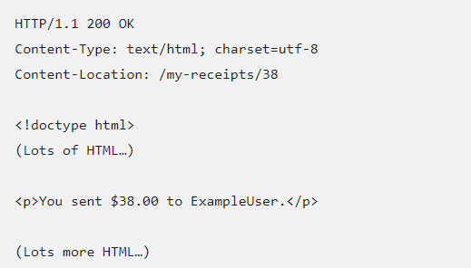
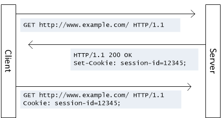
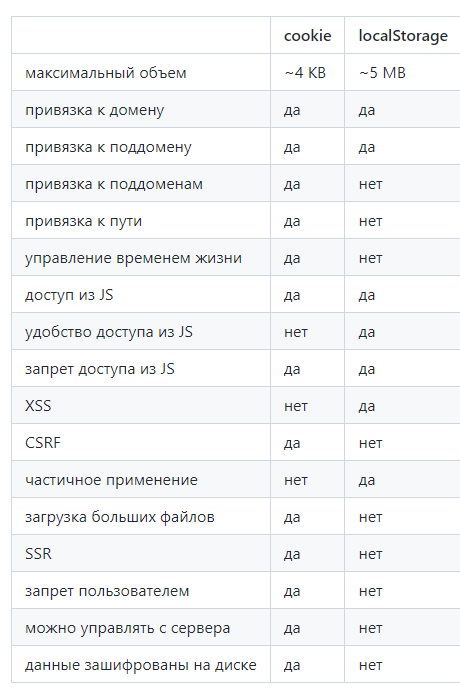

## Questions

### HTTP

1. Что такое HTTP? Как работает (этот протокол передачи) он?
2. Разница между HTTP и HTTPS?
3. Из чего состоит (структура) HTTP-запрос?
4. Какие методы может иметь HTTP-запрос?
5. Разница между PUT- и POST-запросами?
6. Разница между GET- и POST-запросами?
7. Можем ли мы закешировать POST? Что такое кешировать и перечислите кешируемые и не кишируемые методы
8. Что такое HTTP cookie? Для чего они используются?
9. Как происходит аутентификация с использованием куки?
10. Что такое веб-хранилище (web storage)?
11. Разница между cookie, sessionStorage и localStorage?
12. Что такое IndexedDB в браузере? Преимущества IndexedDB?
13. Что такое CORS?
14. Что такое WebSocket? В чем принцип его работы?
15. Разница между протоколами TCP и UDP?

### 1. Что такое HTTP? Как работает (этот протокол передачи) он?

HTTP (HyperText Transfer Protocol) - это протокол для передачи гипертекстовых документов по типу:
html. Создан он был для связи между веб-сервером и веб-браузером.  

HTTP - это протокол без сохранения состояния, то есть сервер не сохраняет никаких данных (состояние между двумя парами "запрос-ответ", а также он следует классической: клиент-серверной модели. Это когда клиент (компьютер, телефон, ноутбук - удаленная система) отправляют запросы и получают ответ от сервера (поставщик услуг). Однако стоит упомянуть что между ними существует посредник, которого называют прокси (облегчает доступ, перехватывает запросы и возвращает его)

---

### 2. Разница между http/https?

Https - это расширение протокола http для поддержки шифрования в целях повышениях безопасности. Он обеспечивает защиту от атак, основанных на прослушивание сетевого соединения.

Https использует SSL (Secure Sockets Layer) и TLS (Transport Layer Security) для шифрования соединения между клиентом и сервером. Оно позволяет безопасно обмениваться (конфиденциальными) данными с сервером. 

Однако стоит упомянуть, что SSL и TLS - один и тот же сертификат, однако SSL более поздняя версия А вот TLS на сегодняшний момент поддерживаются всеми современными браузерами. Он защищает данные через интернет. Предотвращает взлом. Переписки

У http порт 80 и он не защищен, а у https по умолчанию используется 443 порт-тсп

---

### 3. Из чего состоит (структура) http-запроса?

Http-запрос делится на 2 составляющие основное и дополнительное. К основному относится:

- http-method: get (_получить данные_), post (_отправить данные_), put (_обновляет данные_), delete (_удалить их_) и т.д. Метод помогает определить какой тип операции хочет выполнить пользователь;
- Запрос содержит путь к ресурсу;
- В запрое указывается http-протокол;

К дополнительному относится:

- Различные заголовки, которые отправляют доп.информацию на сервер
- В запросе может быть тело, которая содержит информацию. Например, если используется запрос: put (_предназначенные для обновления данных_), то в теле запроса могут быть указаны ключи и значение, которые должны быть обновлены

Еще стоит отметить, что http-request равен http-request
---

### 4. Какие методы может иметь HTTP-запрос?

Основных методов: 9, разделим на основные и дополнительные. К основным относятся:

- `GET` - запрос на получения данных. Данные метод только может получать данные
- `POST` - используется для отправки данных. Например: когда мы регистрируемся где-то, то отправляет запрос с post; когда создаем формочку отправляем запрос
- `PUT` - когда мы хотим обновить (изменить) текущий ресурс.
- `DELETE` - когда мы хотим удалить указанные данные.

К дополнительным относится:

- `HEAD` - запрашивает заголовки, похож на get с отличием то что сервер не посылает ничего в информациюонной части ответа. Он запрашивает только информацию заголовка о файле или ресурса
- `CONNECT` - устанавливает связь с ресурсом,организовывает своеобразный “туннель”. Клиент отправляет запрос прокси-сервер, который устанавливает зашифрованное соединение с сервером, устанавливая канал, по которому клиент и сервер могут безопасно обмениться сообщениями
- `TRACE` - позволяет следить за тем, что происходит с сообщением в промежуточных узлах. Он применяется для диагностики. Он позволяет видеть клиенту, что происходит в каждом звене цепочки между компьютером клиента и конечным получателем. Ответы сервера на метод TRACE не кэшируются.
- `PATCH` - используется для частичного изменения ресурса.
- `OPTIONS` - позволяет получить сведения о деталях соединения с ресурсом. Благодаря данному методу можно узнать какие другие методы допустимы при обращении к ресурсу (передается в ответе в хэдере Allow).

---

### 5. Разница между PUT- и POST-запросами?

1. Post необходим для отправки каких-то данных. Например сообщения. А put для изменения каких-то данных. То есть человек отправил какое-то сообщение через post. Увидел в нем ошибку, решил изменить букву через put, тот в свою очередь удаляет старую запись и добавляет новую при этом он будет доступен через тот же url.
2. Post в случае успеха возвращает 201 и location на новый ресурс, а put может вернуть 201 (если ресурс не найден) так и 204 (no content, если ресурс обновлялся). В любом случае успешно обновили сообщения
3. Метод PUT должен быть `идемпотентным`, то есть несколько одинаковых PUT на один endpoint не меняют состояния API. POST не обязан быть идемпотентным
4. Метод POST подразумевает, что Вы передаёте данные в теле запроса. Метод PUT подразумевает, что Вы передаёте всё, что нужно в URL. Тела запроса нет.

Дополнительная информация:

Если многократное повторение одних и тех же запросов возвращает одинаковые результаты, то метод считается **идемпотентным**. К нему также относятся следующие методы: `GET, HEAD, OPTIONS, PUT, TRACE`

---

### 6. Разница между GET- и POST-запросами?

1. `GET` в основном используется для получения информации, а `POST` для отправки данных
2. У `GET-запроса` нет тела (как правило, но в теории никто не запрещает отправить с телом).
3. `Get` - идемпотетный, а `Post` - нет

---

### 7. Можем ли мы закешировать POST? Что такое кешировать и перечислите кешируемые и не кишируемые методы

Кешируемые ответы - это HTTP-ответы, которые могут быть закешированы, то есть сохранены для дальнейшего восстановления и использования позже, тем самым снижая число запросов к серверу.

Post можно закешировать, если указан признак "свежести" данных и установлен заголовок Content-Location (en-US). Заголовок Content-Location указывает альтернативное место для возвращаемых данных.

Стоит отметить, что FireFox не поддерживает это

К кешируемый методам относится: `GET/HEAD`; `POST/PATCH`, но признаком "свежести" данных и установлен заголовок Content-Location (en-US). К некишируемым относится: `PUT/DELETE`

---

### 8. Что такое HTTP cookie? Для чего они используются?

Куки – это небольшие строки данных, которые хранятся непосредственно в браузере. Когда сервер отправляет браузеру фрагмент каких-либо данных, то браузер может сохранить их у себя. Куки обычно устанавливаются веб-сервером с помощью set-cookie, а затем браузер будет добавлять с помощью заголовка cookie. Одно куки вмещает до 4kb данных, разрешается более 20 куки на сайт (зависит от браузера).

Куки могут использовать для:
- управления сеансом - логины, корзины для вирт.покупок;
- монеторинга - отслеживания поведения пользователей;
- персонализация - пользовательские предпочтения.

Стоит отметить, что с каждым новым запросом к одному и тому же серверу, для них можно создать срок действия, после которого они будут перезапрошены или не будут отправляться, а также можно указать ограничение на путь или домен.

---

### 9. Что такое веб-хранилище (web storage)?

Инструмент для хранения данных в виде пары: ключ-значение в браузере. Существует два вида хранения информации: sessionStorage и localStorage. Основное отличие их: 

- localStorage (локальное хранилище) - предназначена для хранения данных текущего пользователя не ограниченная кол-во времени
- sessionStorage (сессионное хранилище) - служит для хранения данных пока в браузере не закроем вкладку, а затем данные будут потеряны

Объекты хранилища localStorage и sessionStorage предоставляют одинаковые методы и свойства:
- setItem(key, value) – сохранить пару ключ/значение.
- getItem(key) – получить данные по ключу key.
- removeItem(key) – удалить данные с ключом key.
- clear() – удалить всё.
- key(index) – получить ключ на заданной позиции.
- length – количество элементов в хранилище.

---

### 10. Разница между cookie, sessionStorage и localStorage?

Local Storage (локальное хранилище)
- Хранит данные долго.
- Очищается только с помощью JavaScript или очистки кэша браузера.
- Хранит данные объёмом до 5 МБ, это самый большой объём из трёх вариантов хранилища.
- Не поддерживается старыми браузерами, например, IE 7 и ниже.
- Работает по правилу ограничения домена (same origin policy). То есть сохранённые данные доступны только для одного источника.

Session Storage (сессионное хранилище)
- Хранит данные, пока не закроется браузер, и затем данные становятся недоступными.
- Используется контекст браузера верхнего уровня, поэтому каждая вкладка браузера хранит уникальные данные.
- Объём данных больше чем в Cookie.
- Не поддерживается старыми браузерами, например, IE 7 и ниже.

Cookie
- Хранит данные, которые можно передавать на сервер через заголовки.
- Локальное и сессионное хранилище доступны только на клиентской стороне.
- Срок хранения устанавливается при создании cookie.
- Объём данных не превышает 4 Кбайт.
- Cookie могут быть защищёнными, в этом случае их содержимое нельзя получить на стороне клиента. Это важно для аутентификации при хранении пользовательских токенов

---

### 11. Что такое IndexedDB в браузере? Преимущества IndexedDB?

IndexedDB - это NoSQL база данных, которую можно использовать внутри любого браузера для хранения большого количества данных

Основные отличия:

- Нет ограничений по размеру; если ваше приложение работает с большим количеством данных, больше, чем несколько мегабайт.
- Обрабатывают более сложные структуры данных
- Могут работать с разными базами данных и таблицой внутри каждой базы данных
- Больше контроля по взаимодействую с хранилещем

*доделать*
---

### 12. Что такое CORS?

Он дает доступ к выбранным ресурсам с сервера на источнике (домене), отличном от того, что сайт использует в данный момент.

На что ругается CORS? - Только на аякс запросы - джаваскриптовые запросы, а точнее XML-

---

### 13. Что такое WebSocket? В чем принцип его работы?

---

### 14. Разница между протоколами TCP и UDP?

Различая заключается в том, что у TCP мы получили целостный документ, но скорость передачи страдает, а UDP он уже быстрее получает данные
