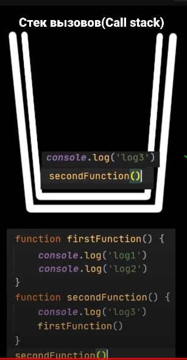
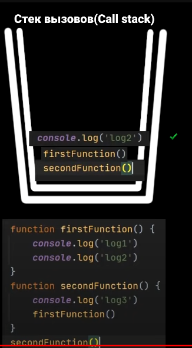

## Questions 
---
### 1. [Function](#Function)
### 2. [Promise](#Promise-ajax-async-await)
### 3. [Another](#Another)
---

### Function
<details>
<summary> 1. Что такое выражения (expression) и инструкции (statement) в JavaScript?</summary>

I. Выражение - это код, который после выполнения возвращает какое-либо значение. Например 5 + 3 = 8, a Math.random - случайное число. К выражением относятся: `+, -, *, /, %, >, =, ==, i++, --i`

II. Инструкция - это фрагмент кода, который выполняется какое-то определенное действие, другими словами является командой. К инструкциям относятся: `if, if-else, while, for, for..in, for..of switch, for-in, объявления переменных`
</details>

<details>
<summary>
2. Разница между function declaration и function expression?
</summary>

Функция – специальный тип объекта. Функции могут быть присвоены, cкопированы или объявлены в любом месте коде. И выделяют два способа объявлении функции:

- `Function Declaration` – функция, созданная в основном потоке кода (объявлении функции через function). Для начала указываем ключевое слово: function, а затем имя функции и внутри фигурных скобок описываем её логику:

```
function sum(a, b) {
  return a + b;
}
```

- `Function Expression` – создать безымянную функцию и записать ее в какую-либо переменную.

```
var sum = function(a, b) {
  return a + b;
}
```

Основное (существенное) отличие – функция, объявленная как Function Declaration, будут доступны, даже если обратиться к ним до того, как они были объявлене.

```
Function declaration

sayHi("Вася");                    // Привет, Вася
function sayHi(name) {
  alert( "Привет, " + name );
}
```

Происходит это благодаря механизму, которая называется Hoisting (всплытие)

</details>

<details>
<summary> 3. Что такое поднятие (Hoisting)? Как он работает для переменных и функций?</summary>

Hoisting представляет процесс доступа к переменным до их определения. Компиляция кода происходит в два прохода:

1. При первом проходе компилятор получает все объявления переменных, все идентификаторы. При этом никакой код не выполняется, методы не вызываются.
2. При втором проходе собственно происходит выполнение. <br/>

А это значит, что переменные объявленые через var, а также Function Declaration (объявлении функции через function) можно получить доступ еще до объявление значение. Они могут спокойно идти в конце документа, а обращаться к ним мы можем в любом месте JS.<br/>

```
console.log(foo);       // undefined
var foo = "Tom";


display();
function display(){
    console.log("Hello Hoisting");
}
```

let, const, function expression не сплывают и вместо undefined мы получим ошибку referenceError, так как к ним не присваивается начальное значение и обратится к ним раньше приведет лишь к ошибке <br/>

```
console.log(foo);   // Uncaught ReferenceError: Cannot access 'foo' before initialization
let foo = "Tom";
console.log(foo);   // не будет выполняться
```

---
</details>

<details>
<summary> 4. Что такое область видимости (Scope) </summary>
Область видимости – это место откуда мы имеем доступ к переменным или функциям. В JS есть три типа областей видимости:

- Глобальная (когда мы «просто объявляем переменную», вне функций, вне модулей, то эта переменная попадает в глобальную область видимости.) И она доступна откуда угодно. Будет доступно внутри функции объекта и т.д. и т.п.

```
const a = 4
console.log(a)
function wrap() { const b = a }
const c = { d: a }
function secondWrap() {  const e = { f: a }  }

```

- Функциональная или локальная (переменные и функции объявленные внутри функций, доступны только этой функции и всем вложенным в неё функциям. За ее пределами при обращении к переменной мы получаем ошибку)

```
const a = 42

function scoped() {
  const b = 43
}

console.log(a)   // 42
console.log(b)   // Reference error.
```

- Блочная – она находится внутри фигурных скобок {} так называемого блока, Например: if … else. Оно находится внутри определенного блоко и вызвать его снаружи вызовет лишь ошибку. Переменные var не имеют блочной области видимости, они ограничены, как минимум, телом функции, то есть грубо говоря оно будет игнорироваться

```
const a = 42
console.log(a)      // 42

if (true) {
  const b = 43
  console.log(a)    // 42
  console.log(b)    // 43
}

console.log(b)      // ReferenceError: Can't find variable: b
```

Также области видимости – набор правил по которым происходит поиск переменных. Сначала переменная ищется в локальной области видимости, если её нет, то поиск происходит во внешней области видимости и так далее пока не дойдет до глобальной.

</details>
<details>
<summary> 5. Разница между var, let и const? </summary>

| Var                                                                      | Let                                                                                      | Const                                                                                     |
| ------------------------------------------------------------------------ | ---------------------------------------------------------------------------------------- | ----------------------------------------------------------------------------------------- |
| Глобальная и локальная область видимости                                 | Блочная область видимости                                                                | Блочная область видимости                                                                 |
| Могут обновляться и объявляться заново                                   | Могут обновлять переменную, но не объявлять заного (два раза let с одним нейминг нельзя) | Нельзя переназначить ( то есть присвоить другое значение в переменной) и объявлять заного |
| Когда поднимает на верхнюю область видимости дает значение как undefined | не дает значение undefined                                                               | не дает значение undefined                                                                |
|                                                                                                            

```
var greeter = "hey hi";
var greeter = "say Hello instead";        // OK

var greeter = "hey hi";
greeter = "say Hello instead";            // OK

let greeting = "say Hi";
greeting = "say Hello instead";           // OK

let greeting = "say Hi";
let greeting = "say Hello instead";       //error: Identifier 'greeting' has already been declared

const greeting = "say Hi";
greeting = "say Hello instead";           //error : Assignment to constant variable.

const greeting = "say Hi";
const greeting = "say Hello instead";     //error : Identifier 'greeting' has already been declared
```

</details>

<details>

<summary> 6. Что такое временная мёртвая зона (temporal dead zone)? </summary>

Появился в ES6 для описания состояния когда переменные недоступны.

- Мы не можем обратится к переменной до её объявления (пока она не будет вычеслена): Uncaught ReferenceError: x is not defined at <anonymous>:1:13

```
// Пример №1
console.log(x)
let x = 'hi'
```

- Если мы пишем переменную, но не присваеваем никакое значение, то оно undefined.

```
let x;                      // undefined
console.log(x)
let x = 43                  // 43

let x = x                   // Ошибка
```

</details>

<details>

<summary> 7.  Как передаются параметры в функцию: по ссылке или по значению? </summary>

Параметры всегда передаются по значению, однако объекты по ссылке.

</details>

<details>
<summary> 8. Что такое IIFE? </summary>

Immediately Invoked Function Expression - это JS-функции, которые выполняется сразу же после объявления. Эта функция анонимна (у нее нет имени) и запускается немедленно. Когда не было лексического окружение на уровне блока кода, он давал простой способ изолировать переменную внутри функции.

```
// Пример №1
(function() {
    console.log("hello world!")
})()

// Пример №2
(() => {
    console.log("hello world!")
})()
```

</details>

<details>
<summary> 9. Что такое анонимная функция? </summary>

Анонимная функция - это функция у которого нет имени после function. Однако если мы обратится через стрелочную функцию и присвоим ей имя, то она будет уже именная фукнция и обратится к нему можно будет через имя. Также можно его вызвать через метод объекта. Можно его также вызвать по клику через addEventListener

```
const myFunc = function () {
    console.log('Hello')
}
myFunc()
```

```
const user = {
    name: 'Alex',
    age: 25,
    greet: function () {
        console.log("hi")
    }
}
user.greet()
```

```
document.getElementById("btn").addEventListener("click", function () {
    console.log("Вы кликнули по кнопке")
})
```

</details>

<details>

<summary>10. Что такое функции высшего порядка (Higher Order Functions)?</summary>

Функции высшего порядка – принимает в качестве аргумента функцию, добавляет в нее новый функционал и возвращает новую функцию, но уже с новым функционалом. К функциям высшего порядка относятся: map, filter, reduce.

</details>

<details>
<summary> 11. Типы функций по способности принимать другие функции? </summary>

В JS можно выделить 3 основные типов функций в зависимости от принимаемых данных:

- Функция первого класса (first-class functions) – это функция, которая не принимает другую функцию в качестве аргумента и не возвращает функцию как значения

`const firstOrder = () => console.log( “Hello”)`

- Функции высшего порядка (HOF) – это функция, которая принимает другую функцию в качестве аргумента или возвращает функцию как значение

`const higherOrder = firstOrderReturn => firstOrderReturn()`

- Унарная функция – это функция, которая принимает только 1 аргумент, который не является функцией.

`const unaryFunction = (a) => console.log(${a} + world!)`

</details>

<details>
<summary>11. Что такое замыкание (Closure)?
</summary>

Замыкание - это следствие работы функции в js. И замыкание создается каждый раз при создании непосредственно функции со своим лексическим окружением. Другими словами когда за пределами функции есть какая-то переменная, то он дает доступ обращаться к этой переменной внутри той функции в которой этой переменной нет.

```
function test() {
	let num = 1;
        return function() {
            console.log(num);
            num++;              // прибавляем единицу
        }
}

let func = test();
```

</details>
<details>
<summary> 12. Что такое чистая функция? </summary>

Чистая функция – функция, которая принимает параметр и всегда возвращает один и тот же результат в зависимости от этого параметра без побочных эффектов. К побочным эффектам относятся: http-запросы и запросы DOM (квериселектор); изменения в файловой системе; видоизменения входных параметров.

```
* Чистая функция *
function calculateGST( productPrice ) {  return productPrice * 0.05;  }
const add = (x, y) => x + y;            add (4, 4);

* Нечистая функция *
let tax = 20;
function calculateGST( productPrice ) { return productPrice * (tax / 100) + productPrice;}
tax = 24
Зависит от внешней переменной и при передаче одного и того же аргумента поттенциально может возвращать разные результаты.

```

Плюсы чистых функций:

- Уменьшает кол-во багов (так как он максимально низко влияет на остальную систему. Если я знаю, что у меня есть баг в функции, то он внутри него)
- Легче тестировать
- Легче понимать, посколько все что она делает заключено внутри нее и не нужно никуда бегать.

</details>
<details>
<summary> 13. Что такое рекурсия? </summary>

Это когда функция вызывает саму себя, однако данная функция может вызыватся "бесконечно". А если мы поставим допустим условия if...else, то он вызовется 10 раз Например:

```
let i = 1;
function func() {
	console.log(i);
	i++;
    // if (i <= 10) { func(); }
}
func();
```

Как мы знаем есть метод: shift - который удаляет первый элемент, исп: рекурсия.

```
function func(arr) {
	console.log(arr.shift(), arr);
	if (arr.length != 0) {
		func(arr);
	}
}

func([1, 2, 3]);

```

Выводит сумму всех элементов:

```
function getSum(arr) {
	let sum = arr.shift();
	if (arr.length !== 0) {
		sum += getSum(arr);
	}
	return sum;
}
console.log(getSum([1, 2, 3]));
```

</details>
<details>
<summary>14. Что такое коллбэк-функция (Callback)? Что такое Callback Hell?
</summary>

Колбэк-функция (или обратный вызов) - это функция, которая переданна в другую функцию в качестве аргумента.

Используется коллбеки например при обращении к API, когда мы  вынуждены ждать ответа, и только после его получения можем выполнять какие-то действия.

Он позволяют разработчику быть уверенным в том, что какой-либо фрагмент кода не начнет выполняться, пока не закончит свое исполнение другой фрагмент кода.
```
function doHomework(subject, alertFinished) {
  alert(`Starting my ${subject} homework.`);
  alertFinished();
}

function alertFinished(){
  alert('Finished my homework');
}

doHomework('math', alertFinished);
```

Callback hell - когда  вложенность большая, что его трудно читать контролировать. Чтобы избежать его можно написать: async/await, разделить на маленькие элементы (функции) и вызывать его в качестве коллбеке

</details>

<details>
<summary>15. Что такое мемоизация? Реализуйте базовую логику функции для мемоизации
</summary>

Мемоизация - метод, который пытается повысить производительность путем кеширование (сохранение) ее раннее вычисленных результатов. Он нужен для предотвращение повторных вычислений, если у нас есть одинаковые аргументы, она не будет выполнена, а результат работы вернется из кеша. Существует минус данного подхода: нужно выделять доп.память

```
const memoize = (fn) => {
	const cache = {}
	return function (param) {
		if(cache[param]) {
			return cache[param]
		} else {
			const result = fn(param);
			cache[param] = result;
			return result;
		}
	}
}

const toUpper = (str = " ") => str.tuUpperCase();
const toUpperMemorized = memoize(toUpper)

toUpperMemoized("Yauhen")			// Call function 'toUpper' get result
toUpperMemoized("Yauhen")			// Doesn't call 'toUpper; return result from 'cache'
```
</details>

<details>
<summary>16. Что такое цикл событий (event loop) и как он работает?  </summary>

Стоит начать с того, что JS -  однопоточный язык, в текущий момент времени может выполняться только 1 задача. А если она слишком ресурсозатратная, то мы не сможем приступить к следующей пока не выполнется это задача. 

Как в однопоточном JS выполнять код асинхронно? - В этом нам помогает такая вещь как event loop. Eventloop - бесконечный цикл, который ожидает задачи, выполняет их и затем снова ожидает поступления новых задач. Но есть такая как стек-вызов. Стек-вызовов - операции всегда попадают на вершину стека и с этой же вершины они выполняются. Сначала выполняется secondFunction(), затем выполняется console.log(3) и сразу же уходить из стека. Затем туда попадает firstFunction, выполняется console.log(1) и сразу же уходить из стекаm, выполняется console.log(2) и сразу же уходить из стека. Затем firstFunction выполняет результат и уходит из стека и затем секондФанкшн выполняет результат и уходит из стека




Стоит отметить, что может так случиться, что задача поступает, когда движок занят чем-то другим (выполняет скрипт, или может истечь таймре), тогда она ставится в очередь.

- Основной поток выполняются в начале 
- Микрозадачи - это промисы и очередь на рендер - выполняются по середине.
- Макрозадачи - браузерность Апи или манипуляция с дом-деревом. К нему односится setTimeOut. Выполняются в конце

```
setTimeout(function timeout() {                // 4
	console.log('Таймаут');
}, 0);

let p = new Promise(function(resolve, reject) {  //1
	console.log('Создание промиса');
	resolve();
});

p.then(function(){								// 3
	console.log('Обработка промиса');
});

console.log('Конец скрипта');				// 2 

```
</details>

<details>
<summary>17. Разница между обычными функциями FD и стрелочными FA?
</summary>

- Синтаксис 
```
`FD`: function one() {...}
const one = function() {...}

`FE`: const one = () => {...}
```

- Arguments, у стрелочных функций его нет. 
```
`FD`: 
function three(a) {
	console.log(arguments)
} 
three('Alex')              // Arguments ['Alex', callee: ƒ, Symbol(Symbol.iterator): ƒ]

`FA`
const three = (a) = {
	console.log(arguments)
}                          // Argument is not defined
```

Он содержит в себе все аргументы, которые передали в качестве аргументов в нашу функцию. Если мы напишем 123, и он в консоль покажет 123 в качестве ключа и значения: {0:1, 1:2, 2:3}

- This есть в обычных функциях, но у стрелочных его нет
- Стрелочные функции не могут быть вызвани с new


</details>

---

### Another (находится доп.вопросы, которые немного задержатся)

<details>
	<summary>18. Что обозначает this в JavaScript? </summary>


</details>

<details>
	<summary> 19. Разница между .call(), .apply() и bind()? и разница между ними </summary>

</details>

---

### Promise; ajax, async, await

<details>
<summary> Что такое промисы (Promises)? </summary>
Промисы - это один из способов работы с асинхронным кодом в JavaScript без написания слишком большого количества обратных вызовов.

Содержит в себе 3 состояния: `pending` - ожидания; `resolved` - выполнено успешно; `rejected` - выполнено с ошибкой.

Объект Promise создаётся при помощи ключевого слова new и своего конструктора. Конструктор Promise принимает в качестве аргумента функцию. Эта функция должна принимать две функции-колбэка в качестве параметров: resolve (если операция завершится успешно) и reject (если операция не удастся, то вернет ошибку)

```
const myFirstPromise = new Promise((resolve, reject) => {
  // выполняется асинхронная операция, которая в итоге вызовет:
  // resolve(someValue); // успешное завершение
  // reject("failure reason"); // неудача
});
```

</details>

<details>
<summary> Разница между Promise.all(), Promise.allSettled(), Promise.any(), Promise.race()? </summary>

`Promise.all()` - ждет когда все промисы выполняться и вернет массив с результатом. Если один из промисов вернет ошибку, то остальные промисы будут игнорироваться

`Promise.allSettled()` - ждёт выполнения всех промисов, при этом неважно, завершились они успешно или с ошибкой. Он особенно удобен, когда запросы независимы и ошибка в одном не влияет на другие, так как Promise.allSettled() дождётся завершения всех запросов. Если же запросы зависимы, то лучше использовать метод Promise.all().

`Promise.any()` - ждет когда выполнится первый успешный промис (без ошибки), он становится результатом, а остальные будут игнорироваться. Если ни один из промисов не завершится успешно , AggregateError становится ошибкой Promise.any

`Promise.race()` - выполнится первый промис, остальные будут игнорировать. Стоит отметить, что не важно выполнится ли успешно промис или с ошибкой. Его используют, чтобы запустить несколько промисов и дождаться того, который выполнится быстрее.

</details>


<details>
<summary> Преимущества использовании промисов вместо колбэков? </summary>

1. Помогает избежать коллбек-хелл, который может быть нечитаемым
2. Упрощает последовательное написание последовательного читаемого ассинхроного кода с помощью then, а также обработку ошибок с помощью catch()
3. Упрощает написание паралельного ассинхроного кода с помощью Promise.all
4. С использованием промисов можно избежать следующих проблем: колбэк-функция была вызвана слишком рано, поздно или вовсе не была вызвана; функция была вызвана слишком мало или слишком много раз; не удалось передать необходимую среду/параметры; были пропущены ошибки/исключения.
</details>

<details>
    <summary> Что такое async/await? </summary>
</details>


<details>
    <summary> Что такое AJAX?</summary>
</details>


<details>
    <summary> Плюсы и минусы использовании Ajax? Подходы при работе с асинхронным кодом?</summary>
</details>


<details>
    <summary> Какие приемы работы с асинхронным кодом в JS Вы знаете?</summary>
</details>

<details>
	<summary>  Как клиент взаимодействует с сервером? </summary>
</details>