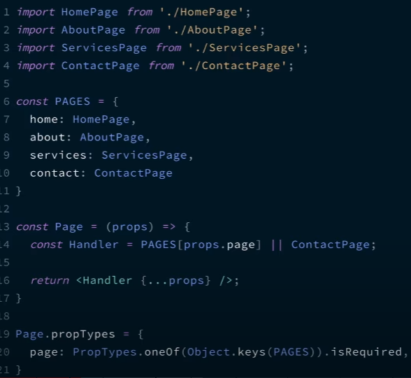

#### React

##### Основы

<details>
<summary> Что такое реакт и перечислите особенности его? </summary>

Это javascript - библиотека с открытым исходным кодом разработанной фейсбуком. Предназначена она для создания пользовательских интерфейсов. Основная философия реакта - компонентный подход, то есть весь интерфейс может быть разбит на минимальные функционирующие единицы => компоненты; и переиспользовать их (компоненты) можно в разы ускорить разработку.

К особенностям относится:

- компоненты - используемые и переиспользуемые;
- jsx облегчает чтение и написание кода
- использование виртуального дома вместо реального
- он универсальный, его можно использовать на сервере и на мобильных платформах с помощью React Native
- он декларативный, разработчик может описать внешний вид разных элементов в любых доступных состояниях. Декларативный подход позволяет сохранить исходный код и сделать его наглядным.

</details>

<details>
<summary> Что такое jsx?  </summary>

Это JSX — расширение языка синтаксиса JavaScript. Используется он для описания того, как должен выглядить пользовательский интерфейс. По сути это синтаксический сахар между createElement() и HTML.

К основным качествам: облегчает понимание, повышает производительность, должен иметь один самый внешний элемент

</details>

<details>
<summary> В чем разница между элементом и компонентом? </summary>

Элемент - простой объект и описывает то, что мы хотим увидеть на экране. Они иммутабельны, то есть они не могут быть изменены после создания.

```
const element = <h1>Привет, мир</h1>;
```

Компонент - это маленькие, повторно используемые части кода, которые возвращают React-элементы для отображения на странице.
Его можно объявит через классовый подход
с методом render(), который наследуется из React.Component. Или он может быть функцией. В обоих случаях, он принимает пропсы на вход и возвращает дерево JSX в качестве вывода:

```
function Welcome(props) {
  return <h1>Привет, {props.name}</h1>;
}
```

</details>

<details>
<summary> Как создавать компоненты в реакте?</summary>

Существует два способа объявленние компонентов:

- Функциональные компоненты - которые на вход получает данные в виде пропсов и возвращает реакт-элементы. Представляет собой функции

```
function Welcome(props) {
  return <h1>Привет, {props.name}</h1>;
}
```

- Классовые компоненты - создаются через классы.

```
class Welcome extends React.Component {
  render() {
    return <h1>Привет, {this.props.name}</h1>;
  }
}
```

</details>

<details>
<summary> Когда использовать компонент класса вместо функционального компонента? </summary>

Когда компоненты необходимы методы состояния или жизненого цикла использется классы. А если нам это не нужно то используетм компоненты функций.

Однако с добавлением хуков мы можем использовать состояния, жизненные циклы и другие функции в функциональном компоненте

</details>

<details>
<summary> Что такое чистые компоненты? (React.PureComponent) </summary>

1. В React.PureComponent реализован метод жизненного цикла shouldComponentUpdate(), отвечающий за проверку, нужно ли производить перерисовку компонента или нет. Он производит поверхностное сравнение пропсов и состояния компонента с предыдущими, чтобы понять, изменились ли они, и перерисовка происходит только в случае нахождения различий.

В React.Component перерисовка происходит всегда, так как подобная проверка отсутствует. Однако при желании ее может реализовать программист.

В функциональных компонентах за это отвечает React.memo()

2. Pure Components - это компоненты, которые не рендерятся повторно при обновлении их состояния и пропов одними и теми же значениями. Если значение предыдущего и нового состояния и пропов равны, компонент не отрисовывается повторно. "Чистые" компоненты ограничивают повторный рендеринг, обеспечивая повышение производительности приложения.

Особенности "чистых" компонентов

- Предотвращают повторный рендеринг компонента, если его состояние и пропы остались прежними
- Неявно реализуют метод shouldComponentUpdate()
- state и props сравниваются поверхностно
- В ряде случаев, такие компоненты являются более производительными

```
import React, { PureComponent } from 'react'

export default class Test extends PureComponent{
   render() {
      return 'Пример компонента с состоянием'
   }
}

```

</details>

<details>
<summary> Что такое стейт (состояние) в реакте</summary>

Состояние компонента (state) — это объект, в котором хранится необходимая компоненту информация, пока он существует. Важно, что состояние контролируется только самим компонентом, другие компоненты не имеют к нему доступа, если только не передать данные из состояния через пропы дочерним компонентам. Состояние может меняться, при этом происходит перерисовка компонента.

Менять состояния можно через хук useState

</details>

<details>
<summary> Что такое пропсы в реакте </summary>

Пропы (props) — это свойства, которые передаются в компонент. Пропы были созданы, чтобы обеспечить передачу данных от родительского компонента к дочернему.

</details>

<details>
<summary> В чем отличие между стейтом и пропсом?</summary>

Пропсы передаются компоненту как параметры функции, тогда как state находится внутри компонента (по аналогии с переменными, которые объявлены внутри функции).

</details>

<details>
<summary> Почему нам нельзя объявить состояние напрявую? </summary>

Если вы попытаетесь обновить состояние напрямую, компонент не будет повторно отображаться.

Вместо этого используйте setState() метод. Он планирует обновление объекта состояния компонента. Когда состояние изменяется, компонент отвечает повторным рендерингом.

</details>

<details>
<summary> В чем разница между обработкой событий HTML и React?</summary>

- В HTML имя события обычно пишется строчными буквами по соглашению: `<button onclick="activateLasers()"></button>`. В то время как в React следует соглашению camelCase :
  `<button onClick={activateLasers}>`

- В HTML мы можем вернуться false, чтобы предотвратить поведение по умолчанию:
  `<a
  href="#"
  onclick='console.log("The link was clicked."); return false;'
/>`. В то время как в React вы должны вызывать preventDefault() явно:

```
function handleClick(event) {
  event.preventDefault();
  console.log("The link was clicked.");
}
```

</details>

<details>
<summary> Как передать параметры обработчику событий (event handler) или обратному вызову (callback-function)? </summary>

1. Если мы говорим про компонент, то через пропсы к дочерним компонентам можно передавать функцию

2. Чтобы передать параметры обработчику событий можно обернуть в стрелочную функцию. Это действие равносильно использованию .bind:

```
<button onClick={() => this.handleClick(id)} />
```

```
<button onClick={this.handleClick.bind(this, id)} />
```

</details>

<details>
<summary> Что такое SyntheticEvents (синтетические события) в Реакте? </summary>

`SyntheticEvents` - это кроссбраузерная обёртка над нативным экземпляром события. Его API такой же, как и собственное событие браузера, включая stopPropagation()и preventDefault(), за исключением того, что события работают одинаково во всех браузерах.

</details>

<details>
<summary> Что такое встроенные условные выражения (inline conditional expressions)?</summary>

Вы можете использовать операторы if или тернарные выражения , доступные в JS, для условного отображения выражений. Помимо этих подходов, вы также можете встроить любые выражения в JSX, заключив их в фигурные скобки, а затем логический оператор JS &&.

```
<h1>Hello!</h1>;
{
  messages.length > 0 && !isLogin ? (
    <h2>You have {messages.length} unread messages.</h2>
  ) : (
    <h2>You don't have unread messages.</h2>
  );
}
```

</details>

<details>
<summary> Что такое ключевое свойство (key) prop и в чем преимущество его использования в массивах элементов?</summary>

A key— это специальный строковый атрибут, который следует включать при создании массивов элементов. Key prop помогает React определить, какие элементы были изменены, добавлены или удалены. Чаще всего в качестве ключа мы используем ID

`const todoItems = todos.map((todo) => <li key={todo.id}>{todo.text}</li>);`

В крайнем случае если нет id, то можно использовать индекс

</details>

<details>
<summary> В чем пользов рефов (refs)? </summary>

В основном нам надо избегать рефов, однако они могут быть полезны когда нам нужен прямой достук к элементу DOM или к экземпляру компоненту

</details>

<details>
<summary> Как создавать рефы (refs)? </summary>

Создаются с помощью метода `React.createRef()` и прикрепляются к элементам React через ref атрибут.

</details>

<details>
<summary> Что такое React.forwardRef</summary>

`React.forwardRef` - функция, которая позволяет передать рефы в качестве пропсов дочерному компоненту.

```
const ButtonElement = React.forwardRef((props, ref) => (
  <button ref={ref} className="CustomButton">
    {props.children}
  </button>
));

// Create ref to the DOM button:
const ref = React.createRef();
<ButtonElement ref={ref}>{"Forward Ref"}</ButtonElement>;
```

</details>

<details>
<summary> Что такое виртуальный дом и как он работает? </summary>

Виртуальный дом - копия реального дома, которая хранится в памяти и в дальнейшем синхронизируется с настоящим домом при помощи библиотеки: Reactdom в App.

По поводу его работы, то всего 3 простых шага:

1. Когда происходит изменения каких-то данных, весь пользовательский интерфейс повторно отображается в представлении Virtual DOM.
2. После устанавливается разница между виртуальным домом и новом
3. И как только это установка будет выполнена, реальный дом изменится

</details>

<details>
<summary> Какая разница между теневым домом и виртуальным домом? </summary>

Они оба отвечают за скорость загрузки страницы, а также создают отдельный экземпляр реального дома, однако отличия их в том, что:

- Virtual-dom создает копию всего объекта DOM, в отличии от shadow-dom, которое создает небольшие фрагменты объекта DOM

- Virtual-dom пытается избегать любых ненужных и дорогостоящих изменения в DOM. Он объединяет несколько изменений и выполняет один повторный рендеринг вместо множества мелких. Он добавляет поддерево элементов DOM в визуализацию документа вместо того, чтобы добавлять его в дерево DOM основного документа.

- Shadow-dom полезен для области видимости CSS. Он гарантирует, что стили, созданные внутри одного элемента Shadow DOM, остаются изолированными и находятся в пределах своей области.

- Shadow-dom реализует браузеры, а virtual-dom: библиотеки Реакт и вью
</details>

<details>
<summary> Что такое React Fiber? Какова его цель? </summary>
Относительно новый механизм, который был положен в основу реакта, начиная с 16 версии. Основной задачей было увеличить производительность для анимации, лейотов, а также раставлять приоритеты. Это и в то же время является его особенность, а именно инкрементальный рендиринг: когда можно разделить работу рендеринга на куски распределить их по нескольким фреймам. 
</details>

<details>
<summary> Что такое контролируемые и не контролируемые компоненты? </summary>

Контролируем компоненты - элементы, которые контролирует реакт, и туда входят следующие теги: input, textarea, select. Для того чтобы сделать управляемый компонент, нужно чтобы значение этих элементов хранилось именно в состоянии React компонента, т.е. управлялось через setState/useState, таким образом состояние React-компонента становится единственным источником правды для этих элементов.

Это неуправляемые компоненты - они хранят свои данные прямо в DOM. Чтобы прочитать их значения, используются рефы.

```

Если мы говорим про управляемые компоненты, то это элементы, которые контролирует React. Оно связано с input, textarea, select. Для того чтобы сделать управляемый компонент, нужно чтобы значение этих элементов хранилось именно в состоянии React компонента, т.е. управлялось через setState/useState

Это неуправляемые компоненты - они хранят свои данные прямо в DOM. Чтобы прочитать их значения, используются рефы.


```

</details>

<details>
<summary> В чем разница между createElement и cloneElement? </summary>

- createElement - Создаёт и возвращает новый React-элемент определённого типа. Код, написанный с использованием JSX, будет преобразован в React.createElement()
- cloneElement - Клонирует и возвращает новый React-элемент, используя элемент в качестве отправной точки (передачи с помощью пропсов)

</details>

<details>
<summary> Что такое поднятие состояния в верх в React? </summary>
Это паттерн, которое с помощью одного состояние может быть использовано сразу для несколько компонентов. Обычно некоторые компоненты должны реагировать на одни и те же события или изменения состояния, поэтому необходимо каким-то образом уведомлять все компоненты когда что-то изменилось как раз и используется состояние поднятие вверх. Это означает что общее состояние должно быть поднятно до общего ближайшего предка
</details>

<details>
<summary> Назовите стадии (фазы) жизненного цикла (lifecycle) компонента? </summary>

Жизненный цикл компонента состоит из трех отдельных фаз жизненного цикла:

- Moundting (монтирование) => компонент готов к монтированию в DOM браузера. Методы: constructor(), getDerivedStateFromProps(), render()и componentDidMount()жизненного цикла.
- Updating (обновление) => компонент обновляется при изменении его состояния через hook useState или передача пропcов.
- Unmounting (размонтирование) => на последнем этапе компонент не нужен и размонтируется из DOM браузера
</details>

<details>
<summary> Каковы методы жизненного цикла React? </summary>

1. shouldComponentUpdate() - когда нам необходимо указать следующий рендер на основе изменений состояния и пропсов. Он вызывает перед рендером, когда получает новые пропсы или состояние
2. static getDerivedStateFromProps() - вызывается непосредственно перед вызовом метода render. Он должен вернуть объект для обновления состояния или null, чтобы ничего не обновлять. Он необходим когда состояние зависит от изменений в просах
3. getSnapshotBeforeUpdate() - вызывается прямо перед этапом «фиксирования» (например, перед добавлением в DOM). Он позволяет компоненту брать некоторую информацию из DOM перед её возможным изменением.
4. static getDerivedStateFromError() и componentDidCatch() - вызывается после возникновения ошибки у компонента-потомка.
</details>

<details>
<summary> Что такое компоненты высшего порядка? </summary>

Компонент высшего порядка — это функция, которая принимает компонент и возвращает новый компонент. Она смотрит на входящие пропсы и принимает на их основании решение : перерисовывать или не перерисовывать.

</details>

<details>
<summary>  Что такое контекст? </summary>
</details>

Он разработан для передачи данных от одного компонента к другой избегая промежуточные компоненты. Например: избегая пропс дриблинга. Чтобы создать контекст нужно написать React.createContext(), затем используя provider мы оборачиваем наш компонент, в нем мы также задать значения, а чтобы получить доступ необходимо обернуть в Consumer()

</details>

<details>
<summary>  Что такое props.children? </summary>

Это контент между открывающим и закрывающим тегом компонента. Например: `<Welcome>Привет, мир!</Welcome>` Для классовых компонентов используйте this.props.children:

</details>

<details>
<summary> Как отрендерить HTML код в React-компоненте? (Как вставить innerHtml в реакт)</summary>

Основная идея в том, что например мы сделали запрос на сервер, а в ответ нам вернулась разметка его нужно отрисовать внутри компонента.

Для подобных задач в реакт существует специальный атрибут: dangerouslySetInnerHTML - атрибут для установки разметки HTML. Однако использование представляет собой угрозу межсайтового скриптинга. Отсюда и приставка dangerously в самом начале. В качестве аргумента принимает объект ключом html и html-разметкой в качестве значения. После чего это разметка будет отрендерена на странице

```
function createMarkup() {
  return {__html: 'Первый &middot; Второй'};
}

function MyComponent() {
  return <div dangerouslySetInnerHTML={createMarkup()} />;
}
```

Межсайтового скриптинга (XXS - Вид атаки, при которой в страницу сайта внедряется вредоносный код. При открытии страницы пользователем, код выполняется на его компьютере и устанавливает соединение с веб-сервером злоумышленника, который таким образом получает контроль над системой.)

</details>

<details>
<summary> Что такое компонент-переключатель (Switching Component)? </summary>
Это компонент, который рендерит один из несколько компонентов. Так называемый своеобразный реакт - паттерн, который позволяет реализовать удобный механизм отрисовки нескольких компонентов на основании какого-нибудь условия. Основная идея - структура в виде объекта, которая содержит ключи и соответсвующие им компоненты. Получая пропсы компонент переключатель вытягивает из них значения ключа. После чего по этому значению возвращает нужный компонент, которому с помощью спред оператора передаются все пропсы.

</details>

<details>
<summary> Что такое распределенный компонент? </summary>

Распределенный компонент - это разновидность компонента, который управляет своим внутренним состоянием, а логику рендеринга делегирует другому компоненту. Таким образом, место определения компонента отделяется от места его реализации. Это предоставляет возможность защитить специфическую логику от остального приложения, предоставляя "чистый" и выразительный API для потребления компонентом.

Они конструируются таким образом, чтобы оперировать набором данных, которые передаются через дочерние компоненты вместо пропов. Под капотом они используются низкоуровневое API, такое как React.children.map() и React.cloneElement(). С помощью этих методов компонент получает возможность к "самовыражению" способом, обеспечивающим возможность применения паттернов, связанных с композицией и масштабируемостью.

```
function App() {
  return (
    <Menu>
      <MenuButton>
        Операции <span aria-hidden>▾</span>
      </MenuButton>
      <MenuList>
        <MenuItem onSelect={() => alert('Download')}>Загрузить</MenuItem>
        <MenuItem onSelect={() => alert('Copy')}>Создать копию</MenuItem>
        <MenuItem onSelect={() => alert('Delete')}>Удалить</MenuItem>
      </MenuList>
    </Menu>
  )
}
```

Компонент `Menu` содержит явно определенное совместное состояние. Компоненты `MenuButton`, `MenuList` и `MenuItem` имеют доступ к этому состоянию, все манипуляции осуществляются в явном виде. Это позволяет получить выразительный API.

</details>

<details>
<summary> Разница между классовым и функциональным компонентами? </summary>

Функциональные компоненты

- Функциональные компоненты - это обычные функции JavaScript. Чаще всего, они представлены в форме стрелочных функций, но их вполне можно создавать и с помощью ключевого слова function
- Их часто называют компонентами без состояния, которые просто принимают данные и отображают их в некоторой форме; поэтому они, в основном, отвечают за рендеринг UI
- В них нельзя использовать методы жизненного цикла (например, componentDidMount())
- У них нет метода render()
- Как правило, они отвечают за UI и форму представления данных (например, компонент кнопки)
- Принимают и используют пропсы
- Им следует отдавать предпочтение в случаях, когда вам не требуется работать с состоянием

Классовые компоненты

- Для создания классовых компонентов используются классы ES6, расширяющие класс React.Component
- Их часто называют компонентами с состоянием, поскольку в них реализуется логика поведения на основе состояния
- Внутри классов могут использоваться методы жизненного цикла (например, componentDidMount())
- Принимают props и имеют к ним доступ через this.props
- Могут содержать refs (ссылки) на нижележащие DOM-узлы
- Могут использовать такие техники улучшения производительности, как shouldComponentUpdate() и PureComponent
</details>

---

### Redux

<details>
<summary> 1. Что такое флакс (Flux)? </summary>

Flux - архитектура, которая придумала предложила фейсбук для решения некоторые проблемы. Он построен на однонаправленном потоке (передачи) данных между компонентами. Флакс содержит 4 компонента - это action (действия), dispatcher (диспетчер), store (хранилище), view (представления).

Если говорить о них по подробней, то action - данные, которая передается диспетчеру. Диспетчер принимает эти данные и уведомляет стор об этом. А стор в свою очередь содержит состояния приложение и логику, после view запрашивает данные у стор и передает его другим (дочерним) компонентам.

</details>

<details>
<summary> 2. Что такое редакс и назовите его основные принципы? </summary>

Redux представляет собой контейнер для управления состоянием приложения, и он похож на Flux. К основным принципам редакса относится:

- единный стор, то есть у него один
- состояние предназначен только для чтения. А чтобы изменить состояние необходим action
- все изменения происходит только с помощью чистых функций.

Стоит отметить, что как у реакта - однонаправленный поток данных (он идет от родителя к потомку), так и у флакса и редакса.

</details>

<details>
<summary> 3. Разница между Flux и Redux? </summary>

- Флакс появился раньше, чем редакс. И как раз на основе флакса был сделан редакс;
- У флакса есть много сторов, а у редакса он один;
- У флакса состояние мутирует, а у редакса не мутирует;

</details>

<details>
<summary> 4. Разница между Redux и React.Context? </summary>

Стоит начать с того, что редакс более мощнее и у него больше функций чем в контексте. Например в контексте: нет редюсеров и санков. Вместо санков нам надо писать все с хуком useEffect(). А вся логика контекст его в компоненте, что делает компонент более большим и громоздким. Отличительными чертами также является:

- В редаксе мы используем useDispatch(), а в контексте useUpdate();
- В контексте нам нужно постоянно писать спред операторы, а вот в редаксе тулките можно этого не делать, так как он под капотом за нас это делает.

</details>

<details>
<summary> 5. Что такое редюсер?</summary>

Редьюсер - чистая функция, которая принимает два параметра:

- state;
- action;

</details>

<details>
<summary> 6. Раскажите про хуки useDispatch() и useSelector()</summary>

</details>

<details>
<summary> 7. Что такое редакс-санки?</summary>

</details>
