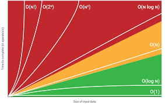

Big O Notation - используется для описания (оценки) сложности алгоритма. Он показывает как будет меняться производительность алгоритма в зависимости от роста входящих данных. При увеличении входящих данных будет рости две вещи - время (за которое будет отрабатывать наш алгоритм) и кол-во памяти используемых для обработки всего этих данных



Снизу описано от самой быстрой O(1) к самому долгому O(N!) выполнение алгоритмической задачи. 

1. O(1) - константная сложность - код выполняется за одно и то же время и никак не зависит от размера входных данных. Например: прежде чем выполнится код снизу, ему необходимо сделать 100 шагов.

```
void f() {
  for(int i = 0; i < 100; i++) {
    ...
  }
}
```

2. O(log n) - логарифмическая сложность - Например: бинарный поиск. Если массив отсортирован, мы можем проверить, есть ли в нём какое-то конкретное значение, методом деления пополам. Проверим средний элемент, если он больше искомого, то отбросим вторую половину массива — там его точно нет. Если же меньше, то наоборот — отбросим начальную половину. И так будем продолжать делить пополам, в итоге проверим log n элементов.

3. O(n) - линейная сложность - например: у нас стоит задача поиска наибольшего элемента в неотсортированном массиве. Нам придётся пройтись по всем n элементам массива, чтобы понять, какой из них максимальный.

4. O(N*log N) -  линейно-логарифмическая сложность -  Например: быстрая сортирова

5. O(n2) - квадратная сложность 

6. O(2n) - экспоненциальная сложность 

7. O(n!) - факториальная сложность